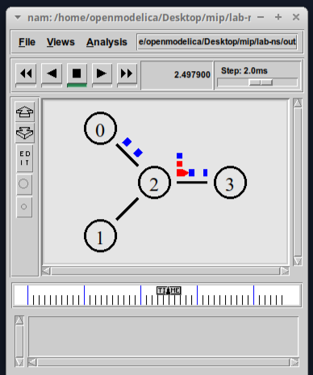

---
## Front matter
lang: ru-RU
title: Лабораторная Работа №1
subtitle: Простые модели компьютерной сети
author:
  - Ощепков Дмитрий Владимирович
institute:
  - Российский университет дружбы народов им. Патриса Лумумбы, Москва, Россия

## i18n babel
babel-lang: russian
babel-otherlangs: english

## Formatting pdf
toc: false
toc-title: Содержание
slide_level: 2
aspectratio: 169
section-titles: true
theme: metropolis
header-includes:
 - \metroset{progressbar=frametitle,sectionpage=progressbar,numbering=fraction}
 - '\makeatletter'
 - '\makeatother'

## Fonts
mainfont: Arial
romanfont: Arial
sansfont: Arial
monofont: Arial
---

## Докладчик

  * Ощепков Дмитрий Владимирович 
  * НФИбд-01-22
  * Российский университет дружбы народов
  * [1132226442@pfur.ru]
  
# Выполнение лабораторной работы

## Цель работы

Приобретение навыков моделирования сетей передачи данных с помощью средства имитационного моделирования NS-2, а также анализ полученных результатов
моделирования.

## Задание

1.1. Шаблон сценария для NS-2
1.2. Простой пример описания топологии сети, состоящей из двух
узлов и одного соединения
1.3. Пример с усложнённой топологией сети
1.4. Пример с кольцевой топологией сети

## Подготовил папки для лабораторных работ (рис. [-@fig:001])

{ #fig:001 width=70% }

## Скопировал код шаблона (рис. [-@fig:002])

{ #fig:002 width=70% }

## Расширил программу после шаблона (рис. [-@fig:003])

{ #fig:003 width=70% }

## Запустил файл через ns (рис. [-@fig:004])

{ #fig:004 width=70% }

## Поменял код, тоже скопировал код из ТУИС (рис. [-@fig:005])

{ #fig:005 width=70% }

## Запустил файл через ns  (рис. [-@fig:006])

{ #fig:006 width=70% }

## Поменял код под кольцевую модель, тоже скопировал код из ТУИС  (рис. [-@fig:007])

{ #fig:007 width=70% }

## Запустил файл через ns (рис. [-@fig:008])

{ #fig:008 width=70% }

## Выводы

Приобрел навыки моделирования сетей передачи данных с помощью средства имитационного моделирования NS-2, а также научился анализу полученных результатов
моделирования.
