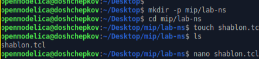
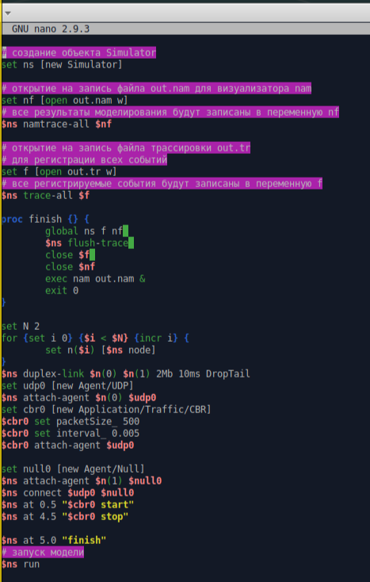
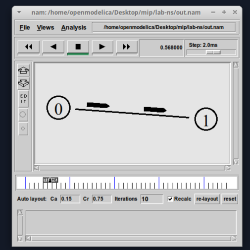
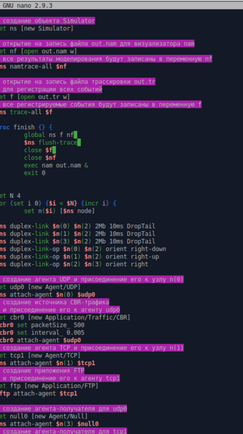
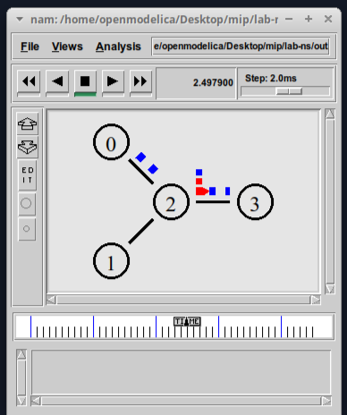
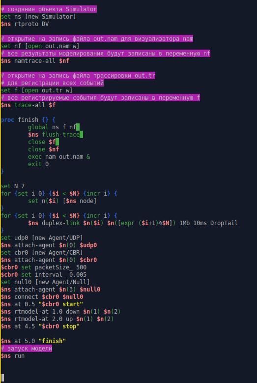
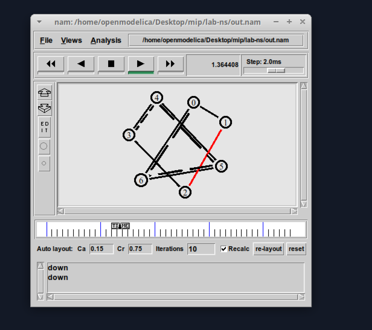

---
## Front matter
title: "Отчёт по лабораторной работе №1"
subtitle: "Простые модели компьютерной сети"
author: "Ощепков Дмитрий Владимирович НФИбд-01-22"

## Generic otions
lang: ru-RU
toc-title: "Содержание"

## Bibliography
bibliography: bib/cite.bib
csl: pandoc/csl/gost-r-7-0-5-2008-numeric.csl

## Pdf output format
toc: true # Table of contents
toc-depth: 2
lof: true # List of figures
lot: true # List of tables
fontsize: 12pt
linestretch: 1.5
papersize: a4
documentclass: scrreprt
## I18n polyglossia
polyglossia-lang:
  name: russian
polyglossia-otherlangs:
  name: english
## I18n babel
babel-lang: russian
babel-otherlangs: english
## Fonts
mainfont: Arial
romanfont: Arial
sansfont: Arial
monofont: Arial
mainfontoptions: Ligatures=TeX
romanfontoptions: Ligatures=TeX
sansfontoptions: Ligatures=TeX,Scale=MatchLowercase
monofontoptions: Scale=MatchLowercase,Scale=0.9
## Biblatex
biblatex: true
biblio-style: "gost-numeric"
biblatexoptions:
  - parentracker=true
  - backend=biber
  - hyperref=auto
  - language=auto
  - autolang=other*
  - citestyle=gost-numeric
## Pandoc-crossref LaTeX customization
figureTitle: "Рис."
tableTitle: "Таблица"
listingTitle: "Листинг"
lofTitle: "Список иллюстраций"
lotTitle: "Список таблиц"
lolTitle: "Листинги"
## Misc options
indent: true
header-includes:
  - \usepackage{indentfirst}
  - \usepackage{float} # keep figures where there are in the text
  - \floatplacement{figure}{H} # keep figures where there are in the text
---

# Цель работы

Приобретение навыков моделирования сетей передачи данных с помощью средства имитационного моделирования NS-2, а также анализ полученных результатов
моделирования.

# Задание

1.1. Шаблон сценария для NS-2
1.2. Простой пример описания топологии сети, состоящей из двух
узлов и одного соединения
1.3. Пример с усложнённой топологией сети
1.4. Пример с кольцевой топологией сети

# Выполнение лабораторной работы

Подготовил папки для лабораторных работ (рис. [-@fig:001])

{ #fig:001 width=70% }

Скопировал код шаблона (рис. [-@fig:002])

{ #fig:002 width=70% }

Расширил программу после шаблона (рис. [-@fig:003])

{ #fig:003 width=70% }

Запустил файл через ns (рис. [-@fig:004])

{ #fig:004 width=70% }

Поменял код, тоже скопировал код из ТУИС (рис. [-@fig:005])

{ #fig:005 width=70% }

Запустил файл через ns  (рис. [-@fig:006])

{ #fig:006 width=70% }

Поменял код под кольцевую модель, тоже скопировал код из ТУИС  (рис. [-@fig:007])

{ #fig:007 width=70% }

Запустил файл через ns (рис. [-@fig:008])

{ #fig:008 width=70% }

# Выводы

Приобретел навыки моделирования сетей передачи данных с помощью средства имитационного моделирования NS-2, а также научился анализу полученных результатов
моделирования.

