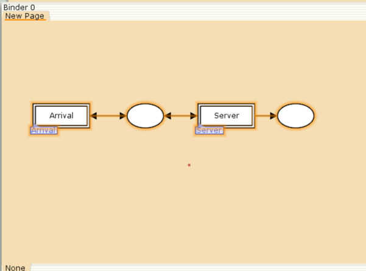
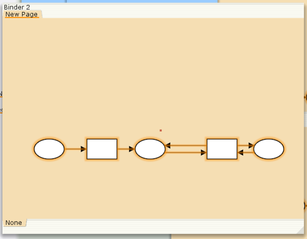
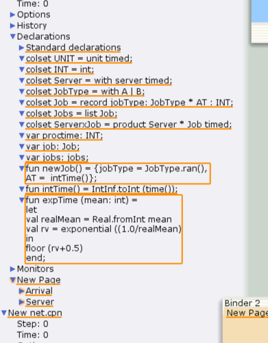
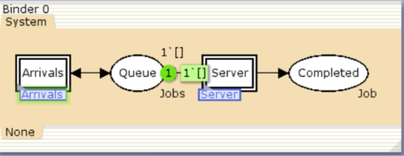
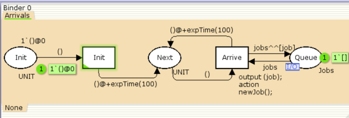
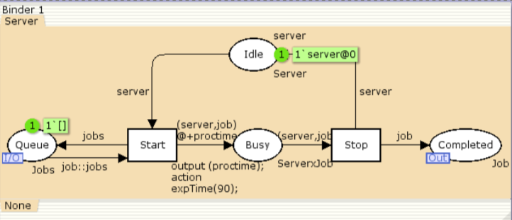
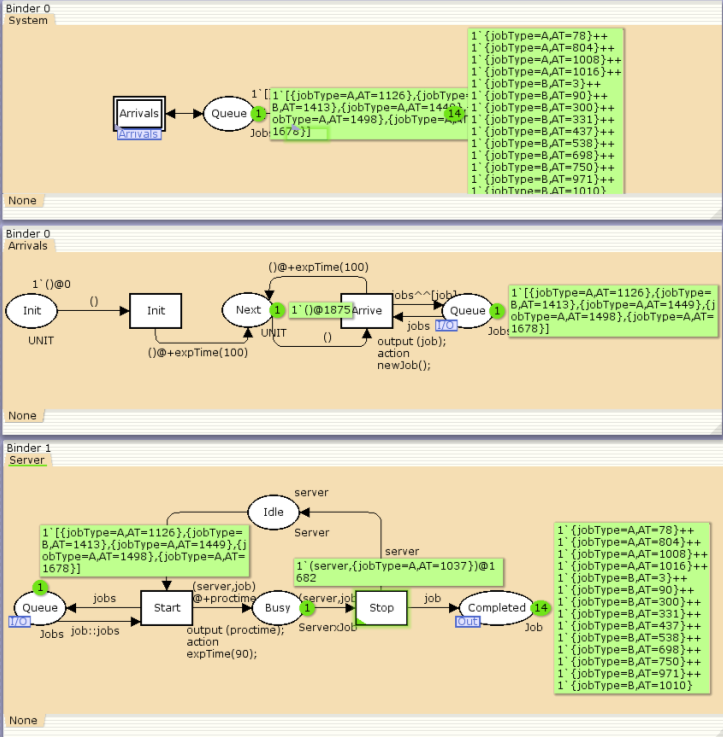
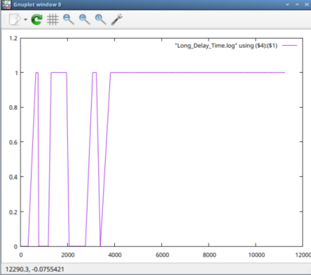

---
## Front matter
lang: ru-RU
title: Лабораторная Работа №11
subtitle: "Модель системы массовогообслуживания M|M|1"
author:
  - Ощепков Дмитрий Владимирович
institute:
  - Российский университет дружбы народов им. Патриса Лумумбы, Москва, Россия

## i18n babel
babel-lang: russian
babel-otherlangs: english

## Formatting pdf
toc: false
toc-title: Содержание
slide_level: 2
aspectratio: 169
section-titles: true
theme: metropolis
header-includes:
 - \metroset{progressbar=frametitle,sectionpage=progressbar,numbering=fraction}
 - '\makeatletter'
 - '\makeatother'

## Fonts
mainfont: Arial
romanfont: Arial
sansfont: Arial
monofont: Arial
---

## Докладчик

  * Ощепков Дмитрий Владимирович 
  * НФИбд-01-22
  * Российский университет дружбы народов
  * [1132226442@pfur.ru]
  
## Цель работы

Реализовать Модель системы массового обслуживания M|M|1

## Задание

В систему поступает поток заявок двух типов, распределённый по пуассоновскому
закону. Заявки поступают в очередь сервера на обработку. Дисциплина очереди -
FIFO. Если сервер находится в режиме ожидания (нет заявок на сервере), то заявка
поступает на обработку сервером.

## Выполнение лабораторной работы

Будем использовать три отдельных листа: на первом листе опишем граф системы, на втором — генератор заявок, на третьем — сервер обработки заявок.

## граф системы

{ #fig:001 width=70% }

## генератор заявок

{ #fig:002 width=70% }

## сервер обработки заявок

{ #fig:003 width=70% }

## Определим декларации 

{ #fig:004 width=70% }

## Параметры элементов основного графа системы обработки заявок в очереди

{ #fig:005 width=70% }

## Параметры элементов генератора заявок системы

{ #fig:006 width=70% }

## Параметры элементов обработчика заявок системы

{ #fig:007 width=70% }

## Мониторинг параметров моделируемой системы

{ #fig:008 width=70% }

## Добавили функцию

fun obs (bindelem) =
let
fun obsBindElem (Server'Start (1, {job, jobs, proctime}))
= (intTime() - (#AT job))
| obsBindElem _ = ~1
in
obsBindElem bindelem
end

## График изменения задержки в очереди
{ #fig:009 width=70% }

## Функцию Observer изменим следующим образом:

fun obs (bindelem) =
if IntInf.tiInt(Queue_Delay.last())>=(!longdelaytime)
then 1
else 0

## Периоды времени, когда значения  задержки в очереди превышали заданное значение

{ #fig:010 width=70% }

# Выводы

Реализовал Модель системы массового обслуживания M|M|1