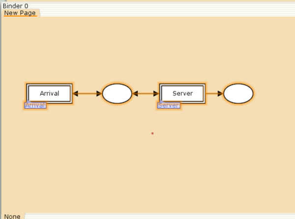
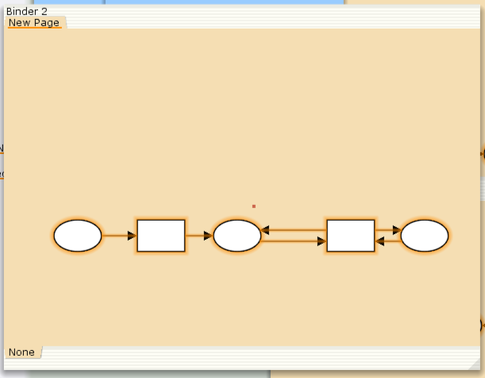
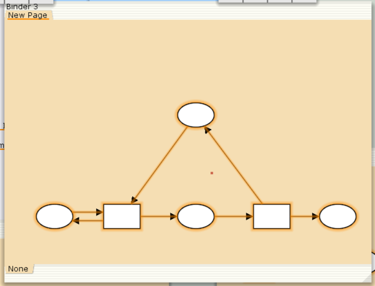
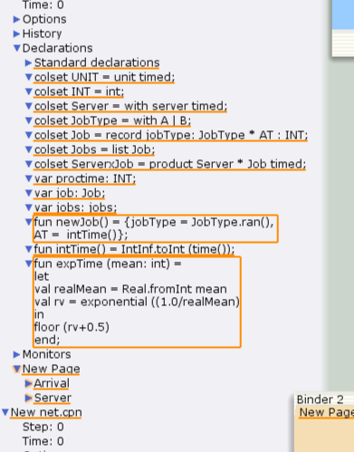
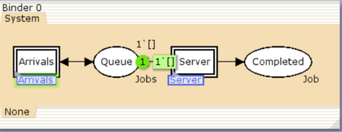
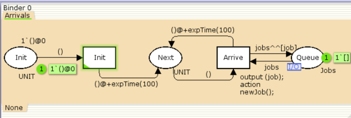
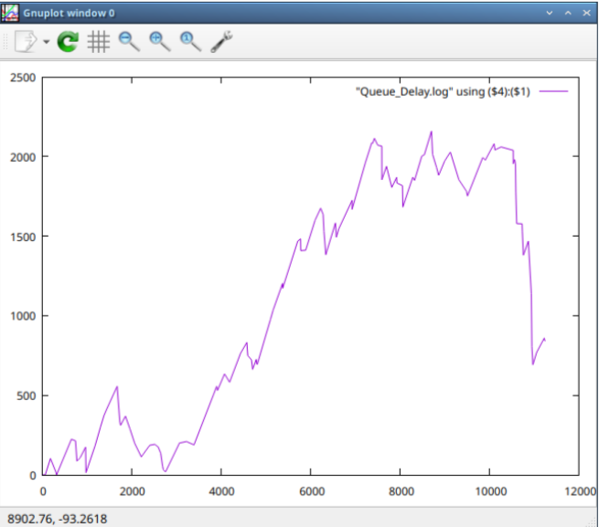
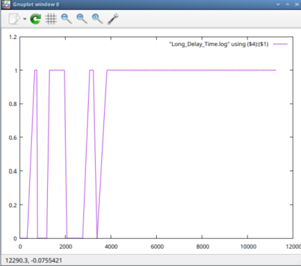

---
## Front matter
title: "Отчёт по лабораторной работе №11"
subtitle: "Модель системы массовогообслуживания M|M|1"
author: "Ощепков Дмитрий Владимирович НФИбд-01-22"

## Generic otions
lang: ru-RU
toc-title: "Содержание"

## Bibliography
bibliography: bib/cite.bib
csl: pandoc/csl/gost-r-7-0-5-2008-numeric.csl

## Pdf output format
toc: true # Table of contents
toc-depth: 2
lof: true # List of figures
lot: true # List of tables
fontsize: 12pt
linestretch: 1.5
papersize: a4
documentclass: scrreprt
## I18n polyglossia
polyglossia-lang:
  name: russian
polyglossia-otherlangs:
  name: english
## I18n babel
babel-lang: russian
babel-otherlangs: english
## Fonts
mainfont: Arial
romanfont: Arial
sansfont: Arial
monofont: Arial
mainfontoptions: Ligatures=TeX
romanfontoptions: Ligatures=TeX
sansfontoptions: Ligatures=TeX,Scale=MatchLowercase
monofontoptions: Scale=MatchLowercase,Scale=0.9
## Biblatex
biblatex: true
biblio-style: "gost-numeric"
biblatexoptions:
  - parentracker=true
  - backend=biber
  - hyperref=auto
  - language=auto
  - autolang=other*
  - citestyle=gost-numeric
## Pandoc-crossref LaTeX customization
figureTitle: "Рис."
tableTitle: "Таблица"
listingTitle: "Листинг"
lofTitle: "Список иллюстраций"
lotTitle: "Список таблиц"
lolTitle: "Листинги"
## Misc options
indent: true
header-includes:
  - \usepackage{indentfirst}
  - \usepackage{float} # keep figures where there are in the text
  - \floatplacement{figure}{H} # keep figures where there are in the text
---

# Цель работы

Реализовать Модель системы массового обслуживания M|M|1

# Задание

В систему поступает поток заявок двух типов, распределённый по пуассоновскому
закону. Заявки поступают в очередь сервера на обработку. Дисциплина очереди -
FIFO. Если сервер находится в режиме ожидания (нет заявок на сервере), то заявка
поступает на обработку сервером.

# Выполнение лабораторной работы

Будем использовать три отдельных листа: на первом листе опишем граф системы, на втором — генератор заявок, на третьем — сервер обработки заявок.

{ #fig:001 width=70% }

{ #fig:002 width=70% }

{ #fig:003 width=70% }

Определим декларации 

{ #fig:004 width=70% }

{ #fig:005 width=70% }

{ #fig:006 width=70% }

{ #fig:007 width=70% }

Мониторинг параметров моделируемой системы

{ #fig:008 width=70% }

Добавили функцию

fun obs (bindelem) =
let
fun obsBindElem (Server'Start (1, {job, jobs, proctime}))
= (intTime() - (#AT job))
| obsBindElem _ = ~1
in
obsBindElem bindelem
end

{ #fig:009 width=70% }

Функцию Observer изменим следующим образом:
fun obs (bindelem) =
if IntInf.tiInt(Queue_Delay.last())>=(!longdelaytime)
then 1
else 0

{ #fig:010 width=70% }

# Выводы

Реализовал Модель системы массового обслуживания M|M|1