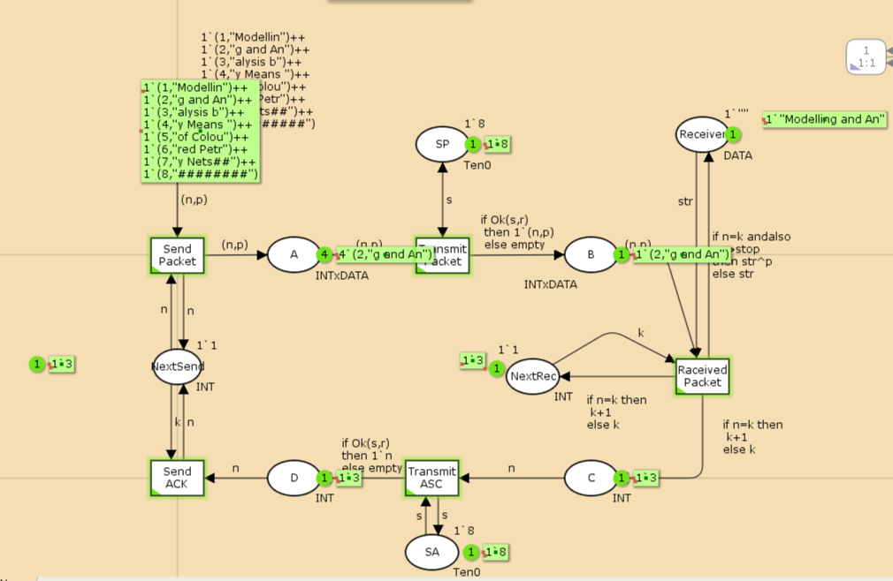
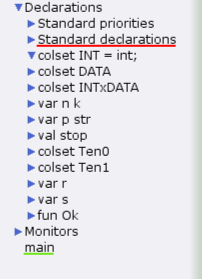
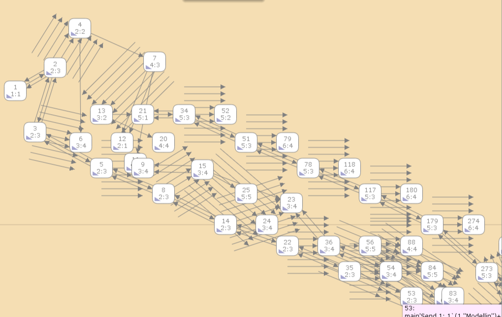
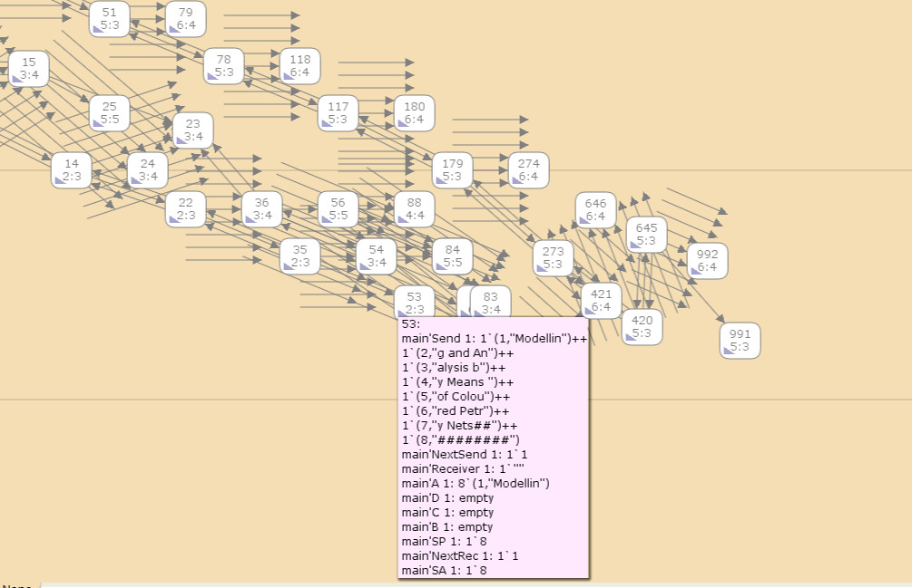

---
## Front matter
lang: ru-RU
title: Лабораторная Работа №12
subtitle: "Пример моделирования простого протокола передачи данных"
author:
  - Ощепков Дмитрий Владимирович
institute:
  - Российский университет дружбы народов им. Патриса Лумумбы, Москва, Россия

## i18n babel
babel-lang: russian
babel-otherlangs: english

## Formatting pdf
toc: false
toc-title: Содержание
slide_level: 2
aspectratio: 169
section-titles: true
theme: metropolis
header-includes:
 - \metroset{progressbar=frametitle,sectionpage=progressbar,numbering=fraction}
 - '\makeatletter'
 - '\makeatother'

## Fonts
mainfont: Arial
romanfont: Arial
sansfont: Arial
monofont: Arial
---

## Докладчик

  * Ощепков Дмитрий Владимирович 
  * НФИбд-01-22
  * Российский университет дружбы народов
  * [1132226442@pfur.ru]
  
## Цель работы

Реализовать простой протокол передачи данных

## Задание

Рассмотрим ненадёжную сеть передачи данных, состоящую из источника, получателя.
Перед отправкой очередной порции данных источник должен получить от получателя подтверждение о доставке предыдущей порции данных.
Считаем, что пакет состоит из номера пакета и строковых данных. Передавать
будем сообщение «Modelling and Analysis by Means of Coloured Petry Nets», разбитое
по 8 символов.

## Выполнение лабораторной работы

Основные состояния: источник (Send), получатель (Receiver).
Действия (переходы): отправить пакет (Send Packet), отправить подтверждение
(Send ACK).
Промежуточное состояние: следующий посылаемый пакет (NextSend).

Зададим промежуточные состояния (A, B с типом INTxDATA, C, D с типом
INTxDATA) для переходов (рис. 12.2): передать пакет Transmit Packet (передаём
(n,p)), передать подтверждение Transmit ACK (передаём целое число k).

## Выполнение лабораторной работы

Таким образом, получим модель простого протокола передачи данных (рис. 12.3).
Пакет последовательно проходит: состояние Send, переход Send Packet, состояние A, с некоторой вероятностью переход Transmit Packet, состояние B, попадает
на переход Receive Packet, где проверяется номер пакета и если нет совпадения,
то пакет направляется в состояние Received, а номер пакета передаётся последовательно в состояние C, с некоторой вероятностью в переход Transmit ACK,
далее в состояние D, переход Receive ACK, состояние NextSend (увеличивая на 1
номер следующего пакета), переход Send Packet. Так продолжается до тех пор,
пока не будут переданы все части сообщения. Последней будет передана стоппоследовательность.

## Граф системы

{ #fig:001 width=70% }

## Определим декларации 

colset INT = int;
colset DATA = string;
colset INTxDATA = product INT * DATA;
var n, k: INT;
var p, str: DATA;
val stop = "########";

colset Ten0 = int with 0..10;
colset Ten1 = int with 0..10;
var s: Ten0;
var r: Ten1;

## Панель деклараций

{ #fig:002 width=70% }

## Упражнение

Вычислите пространство состояний. Сформируйте отчёт о пространстве состояний и проанализируйте его. Постройте граф пространства состояний.

## Граф состояний 

{ #fig:003 width=70% }

## Граф состояний 

{ #fig:004 width=70% }

## Выводы

Реализовал простой протокол передачи данных.