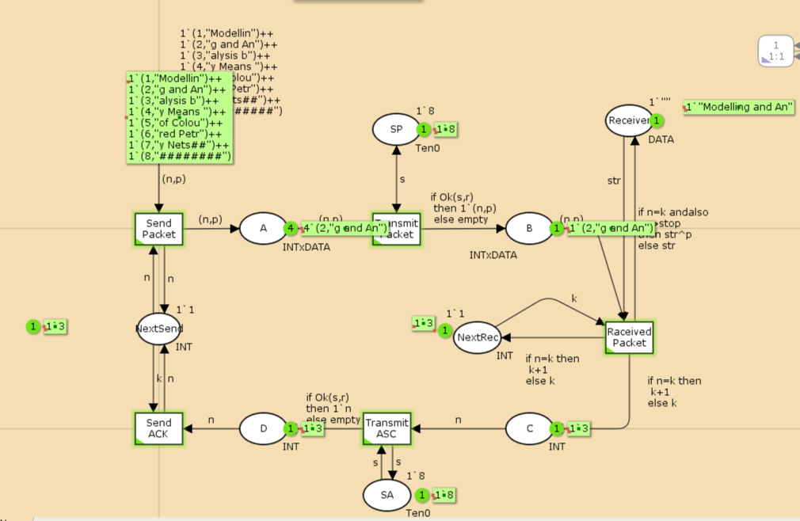
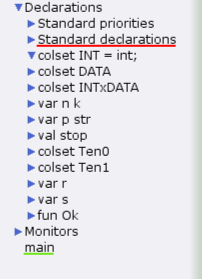
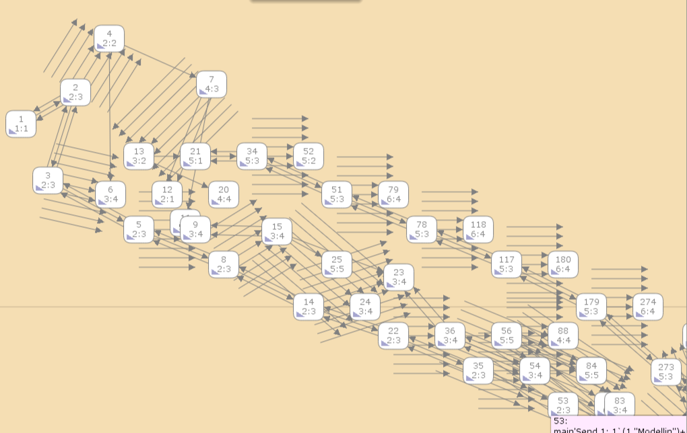
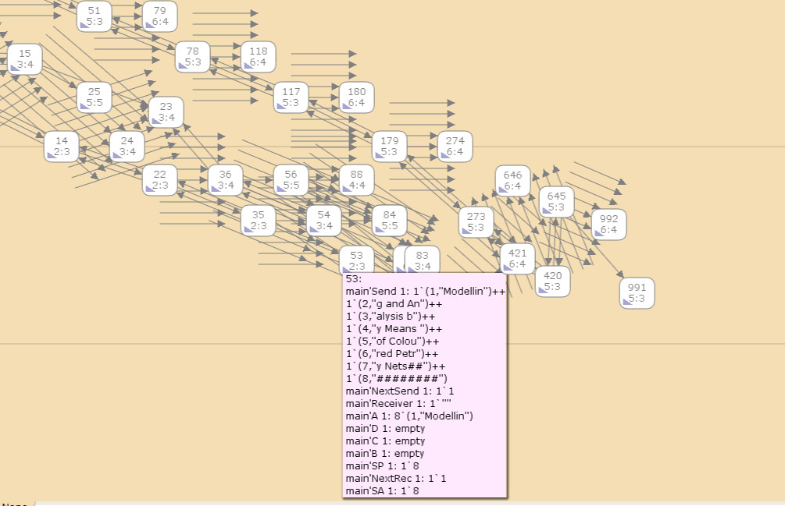

---
## Front matter
title: "Отчёт по лабораторной работе №12"
subtitle: "Пример моделирования простого протокола передачи данных"
author: "Ощепков Дмитрий Владимирович НФИбд-01-22"

## Generic otions
lang: ru-RU
toc-title: "Содержание"

## Bibliography
bibliography: bib/cite.bib
csl: pandoc/csl/gost-r-7-0-5-2008-numeric.csl

## Pdf output format
toc: true # Table of contents
toc-depth: 2
lof: true # List of figures
lot: true # List of tables
fontsize: 12pt
linestretch: 1.5
papersize: a4
documentclass: scrreprt
## I18n polyglossia
polyglossia-lang:
  name: russian
polyglossia-otherlangs:
  name: english
## I18n babel
babel-lang: russian
babel-otherlangs: english
## Fonts
mainfont: Arial
romanfont: Arial
sansfont: Arial
monofont: Arial
mainfontoptions: Ligatures=TeX
romanfontoptions: Ligatures=TeX
sansfontoptions: Ligatures=TeX,Scale=MatchLowercase
monofontoptions: Scale=MatchLowercase,Scale=0.9
## Biblatex
biblatex: true
biblio-style: "gost-numeric"
biblatexoptions:
  - parentracker=true
  - backend=biber
  - hyperref=auto
  - language=auto
  - autolang=other*
  - citestyle=gost-numeric
## Pandoc-crossref LaTeX customization
figureTitle: "Рис."
tableTitle: "Таблица"
listingTitle: "Листинг"
lofTitle: "Список иллюстраций"
lotTitle: "Список таблиц"
lolTitle: "Листинги"
## Misc options
indent: true
header-includes:
  - \usepackage{indentfirst}
  - \usepackage{float} # keep figures where there are in the text
  - \floatplacement{figure}{H} # keep figures where there are in the text
---

# Цель работы

Реализовать простой протокол передачи данных

# Задание

Рассмотрим ненадёжную сеть передачи данных, состоящую из источника, получателя.
Перед отправкой очередной порции данных источник должен получить от получателя подтверждение о доставке предыдущей порции данных.
Считаем, что пакет состоит из номера пакета и строковых данных. Передавать
будем сообщение «Modelling and Analysis by Means of Coloured Petry Nets», разбитое
по 8 символов.

# Выполнение лабораторной работы

Основные состояния: источник (Send), получатель (Receiver).
Действия (переходы): отправить пакет (Send Packet), отправить подтверждение
(Send ACK).
Промежуточное состояние: следующий посылаемый пакет (NextSend).

Зададим промежуточные состояния (A, B с типом INTxDATA, C, D с типом
INTxDATA) для переходов (рис. 12.2): передать пакет Transmit Packet (передаём
(n,p)), передать подтверждение Transmit ACK (передаём целое число k).

Таким образом, получим модель простого протокола передачи данных (рис. 12.3).
Пакет последовательно проходит: состояние Send, переход Send Packet, состояние A, с некоторой вероятностью переход Transmit Packet, состояние B, попадает
на переход Receive Packet, где проверяется номер пакета и если нет совпадения,
то пакет направляется в состояние Received, а номер пакета передаётся последовательно в состояние C, с некоторой вероятностью в переход Transmit ACK,
далее в состояние D, переход Receive ACK, состояние NextSend (увеличивая на 1
номер следующего пакета), переход Send Packet. Так продолжается до тех пор,
пока не будут переданы все части сообщения. Последней будет передана стоппоследовательность.

{ #fig:001 width=70% }

# Определим декларации 

colset INT = int;
colset DATA = string;
colset INTxDATA = product INT * DATA;
var n, k: INT;
var p, str: DATA;
val stop = "########";

colset Ten0 = int with 0..10;
colset Ten1 = int with 0..10;
var s: Ten0;
var r: Ten1;

{ #fig:002 width=70% }

# Упражнение

Вычислите пространство состояний. Сформируйте отчёт о пространстве состояний и проанализируйте его. Постройте граф пространства состояний.

{ #fig:003 width=70% }

{ #fig:004 width=70% }

# Выводы

Реализовал простой протокол передачи данных.