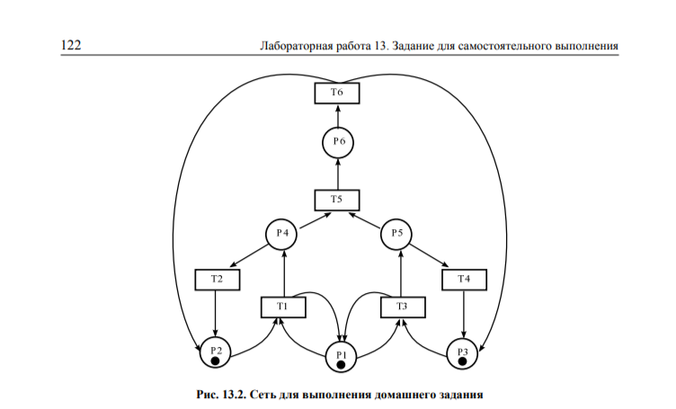
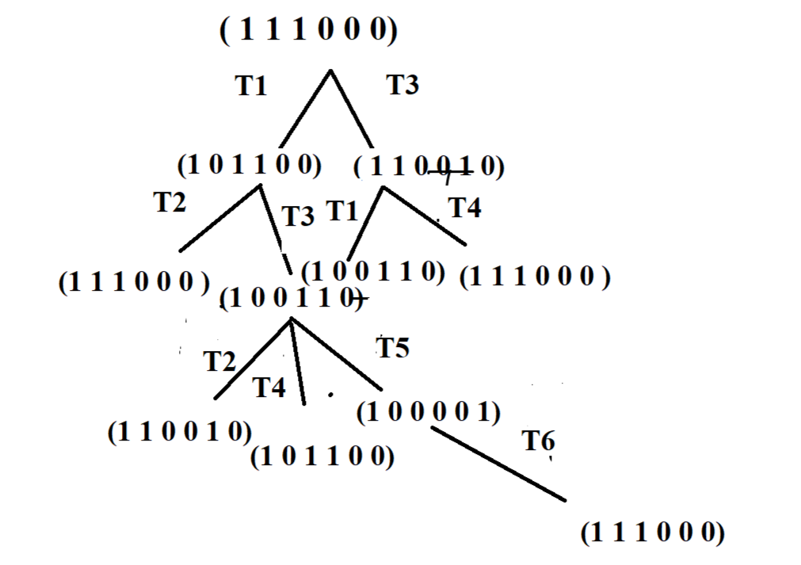
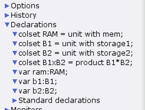
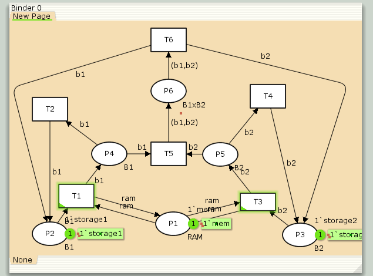
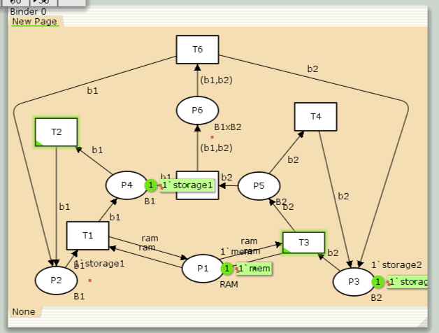

---
## Front matter
lang: ru-RU
title: Лабораторная Работа №13
subtitle: "Задание для самостоятельноговыполнения"
author:
  - Ощепков Дмитрий Владимирович
institute:
  - Российский университет дружбы народов им. Патриса Лумумбы, Москва, Россия

## i18n babel
babel-lang: russian
babel-otherlangs: english

## Formatting pdf
toc: false
toc-title: Содержание
slide_level: 2
aspectratio: 169
section-titles: true
theme: metropolis
header-includes:
 - \metroset{progressbar=frametitle,sectionpage=progressbar,numbering=fraction}
 - '\makeatletter'
 - '\makeatother'

## Fonts
mainfont: Arial
romanfont: Arial
sansfont: Arial
monofont: Arial
---

## Докладчик

  * Ощепков Дмитрий Владимирович 
  * НФИбд-01-22
  * Российский университет дружбы народов
  * [1132226442@pfur.ru]
  
## Цель работы

Самостоятельно реализовать сеть Петри и провести её анализ.

## Задание

1. Провести теоретический анализ сети Петри с помощью построения дерева достижимости
2. Промоделировать сеть Петри в CPN Tools
3. Вычислить пространство состояний и построить граф состояний

## Сеть Петри

{#fig:001 width=70%}

## Анализ свойств сети

1. **Безопасность**: Сеть безопасна, так как число фишек в каждой позиции не превышает 1
2. **Ограниченность**: Сеть ограничена числом 1
3. **Сохраняемость**: Сеть не является сохраняющей, так как происходит потеря фишек
4. **Тупики**: В сети отсутствуют тупики, сеть является цикличной

## Дерево достижимости

{#fig:002 width=70%}

### Декларации 

{#fig:003 width=70%}

## Модель сети

{#fig:004 width=70%}

## Граф состояний

Примечание: При попытке построить полное пространство состояний CPN Tools завершает работу аварийно. Частичные результаты моделирования:

{#fig:005 width=70%}

## Выводы

1. Реализована сеть Петри и проведён её теоретический анализ
2. Построено дерево достижимости, подтверждающее свойства сети
3. Создана модель сети в CPN Tools
4. Несмотря на проблемы с построением полного графа состояний, основные свойства сети подтверждены

