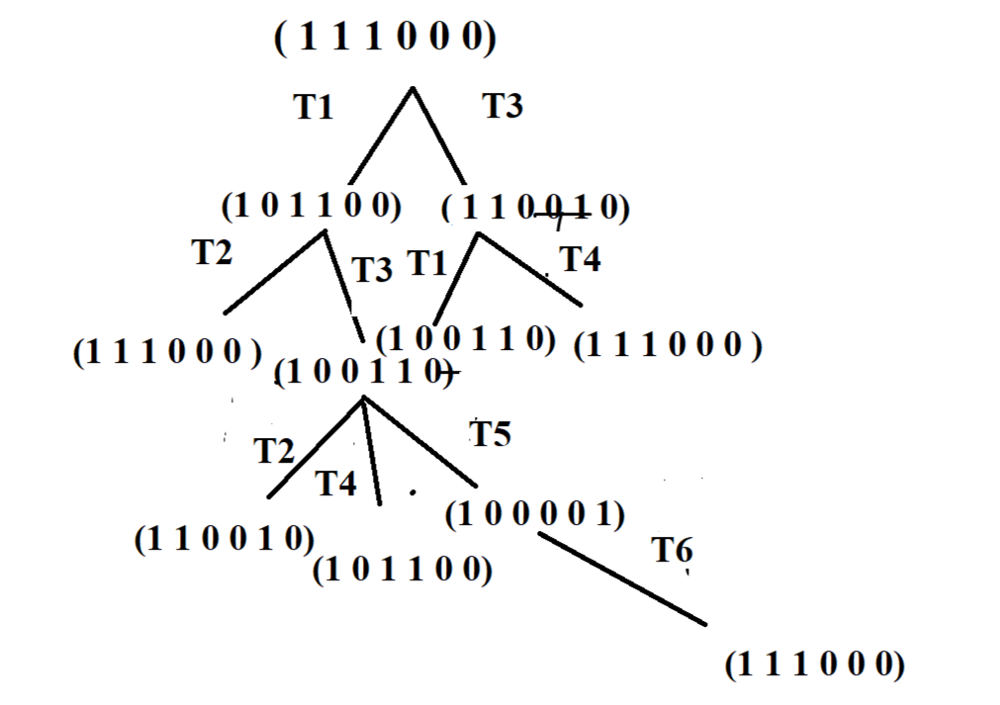

---
## Front matter
title: "Отчёт по лабораторной работе №13"
subtitle: "Задание для самостоятельноговыполнения"
author: "Ощепков Дмитрий Владимирович НФИбд-01-22"

## Generic otions
lang: ru-RU
toc-title: "Содержание"

## Bibliography
bibliography: bib/cite.bib
csl: pandoc/csl/gost-r-7-0-5-2008-numeric.csl

## Pdf output format
toc: true # Table of contents
toc-depth: 2
lof: true # List of figures
lot: true # List of tables
fontsize: 12pt
linestretch: 1.5
papersize: a4
documentclass: scrreprt
## I18n polyglossia
polyglossia-lang:
  name: russian
polyglossia-otherlangs:
  name: english
## I18n babel
babel-lang: russian
babel-otherlangs: english
## Fonts
mainfont: Arial
romanfont: Arial
sansfont: Arial
monofont: Arial
mainfontoptions: Ligatures=TeX
romanfontoptions: Ligatures=TeX
sansfontoptions: Ligatures=TeX,Scale=MatchLowercase
monofontoptions: Scale=MatchLowercase,Scale=0.9
## Biblatex
biblatex: true
biblio-style: "gost-numeric"
biblatexoptions:
  - parentracker=true
  - backend=biber
  - hyperref=auto
  - language=auto
  - autolang=other*
  - citestyle=gost-numeric
## Pandoc-crossref LaTeX customization
figureTitle: "Рис."
tableTitle: "Таблица"
listingTitle: "Листинг"
lofTitle: "Список иллюстраций"
lotTitle: "Список таблиц"
lolTitle: "Листинги"
## Misc options
indent: true
header-includes:
  - \usepackage{indentfirst}
  - \usepackage{float} # keep figures where there are in the text
  - \floatplacement{figure}{H} # keep figures where there are in the text
---

## Цель работы

Самостоятельно реализовать сеть Петри и провести её анализ.

# Задание

1. Провести теоретический анализ сети Петри с помощью построения дерева достижимости
2. Промоделировать сеть Петри в CPN Tools
3. Вычислить пространство состояний и построить граф состояний

# Теоретическая часть

## Сеть Петри

{#fig:001 width=70%}

## Анализ свойств сети

1. **Безопасность**: Сеть безопасна, так как число фишек в каждой позиции не превышает 1
2. **Ограниченность**: Сеть ограничена числом 1
3. **Сохраняемость**: Сеть не является сохраняющей, так как происходит потеря фишек
4. **Тупики**: В сети отсутствуют тупики, сеть является цикличной

# Практическая часть

## Дерево достижимости

{#fig:002 width=70%}

## Моделирование в CPN Tools

### Декларации цветов

{#fig:003 width=70%}

### Модель сети

{#fig:004 width=70%}

### Граф состояний

Примечание: При попытке построить полное пространство состояний CPN Tools завершает работу аварийно. Частичные результаты моделирования:

{#fig:005 width=70%}

# Выводы

1. Реализована сеть Петри и проведён её теоретический анализ
2. Построено дерево достижимости, подтверждающее свойства сети
3. Создана модель сети в CPN Tools
4. Несмотря на проблемы с построением полного графа состояний, основные свойства сети подтверждены

## Основные результаты:
- Сеть является безопасной и ограниченной
- Сеть не сохраняющая
- Тупиковые состояния отсутствуют