---
## Front matter
title: "Отчёт по лабораторной работе №14"
subtitle: "Модели обработки заказов"
author: "Ощепков Дмитрий Владимирович НФИбд-01-22"
date: \today

## Generic options
lang: ru-RU
toc-title: "Содержание"
fontsize: 12pt
linestretch: 1.5
papersize: a4
documentclass: scrreprt

## Fonts
mainfont: Arial
romanfont: Arial
sansfont: Arial
monofont: Arial

header-includes:
  - \usepackage{indentfirst}
  - \usepackage{float}
  - \floatplacement{figure}{H}
---

## Цель работы
Реализовать модели обработки заказов в GPSS.

# Задание

В интернет-магазине заказы принимает один оператор. Интервалы поступления заказов распределены равномерно с интервалом 15 ± 4 мин. Время оформления заказа также распределено равномерно на интервале 10 ± 2 мин. Обработка поступивших заказов происходит в порядке очереди (FIFO). Требуется разработать модель обработки заказов в течение 8 часов.

# Построение модели

\centering
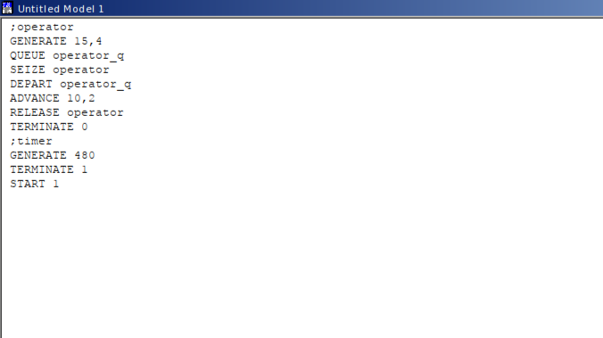{#fig:001 width=85%}

\centering
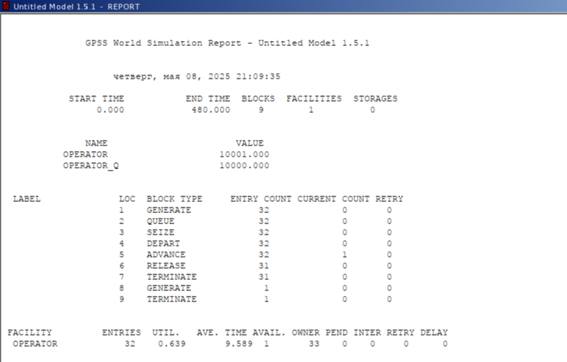{#fig:002 width=85%}

# Упражнение 

Скорректируйте модель в соответствии с изменениями входных данных: интервалы поступления заказов распределены равномерно с интервалом 3.14 ± 1.7 мин; время оформления заказа также распределено равномерно на интервале 6.66 ± 1.7 мин. Проанализируйте отчёт, сравнив результаты с результатами предыдущего моделирования.

\centering
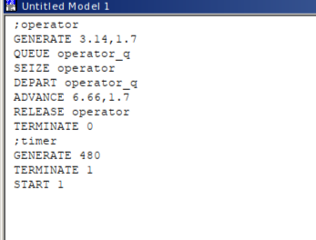{#fig:003 width=85%}

\centering
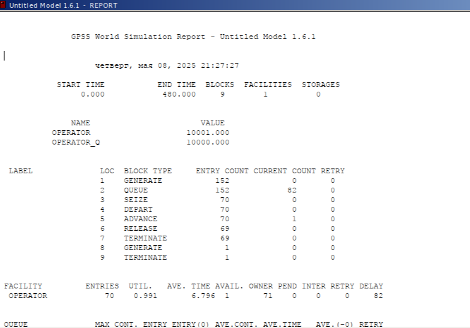{#fig:004 width=85%}

# Построение гистограммы распределения заявок в очереди

\centering
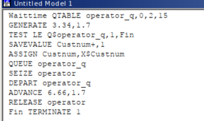{#fig:005 width=85%}

\centering
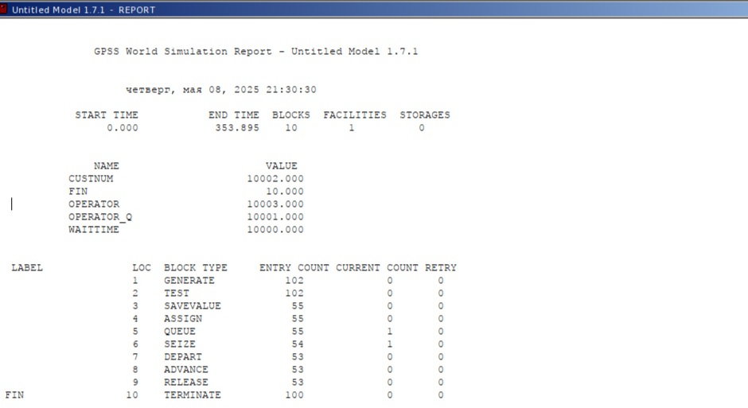{#fig:006 width=85%}

\centering
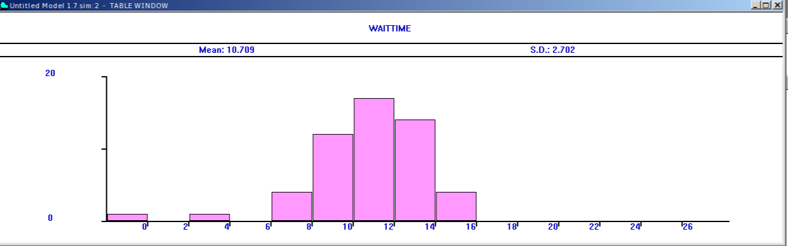{#fig:007 width=85%}

# Модель обслуживания двух типов заказов от клиентов в интернет-магазине

## Постановка задачи

В интернет-магазин к одному оператору поступают два типа заявок от клиентов — обычный заказ и заказ с оформлением дополнительного пакета услуг. Заявки первого типа поступают каждые 15 ± 4 мин. Заявки второго типа — каждые 30 ± 8 мин. Оператор обрабатывает заявки по принципу FIFO («первым пришел — первым обслужился»). Время, затраченное на оформление обычного заказа, составляет 10 ± 2 мин, а на оформление дополнительного пакета услуг — 5 ± 2 мин. Требуется разработать модель обработки заказов в течение 8 часов, обеспечив сбор данных об очереди заявок от клиентов.

\centering
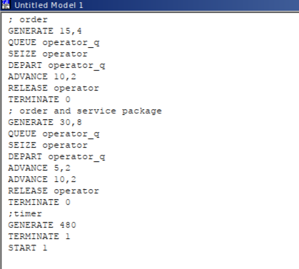{#fig:008 width=85%}

\centering
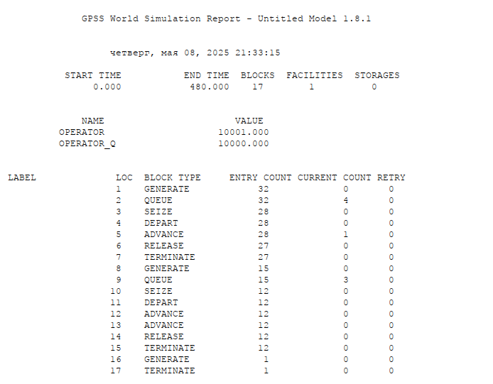{#fig:009 width=85%}

# Упражнение 

Скорректируйте модель так, чтобы учитывалось условие, что число заказов с дополнительным пакетом услуг составляет 30% от общего числа заказов. Используйте оператор TRANSFER. Проанализируйте отчёт.

\centering
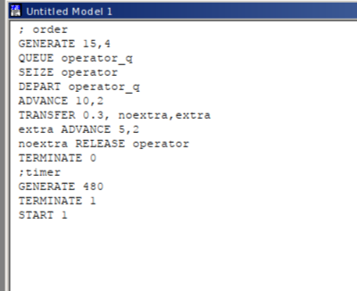{#fig:010 width=85%}

\centering
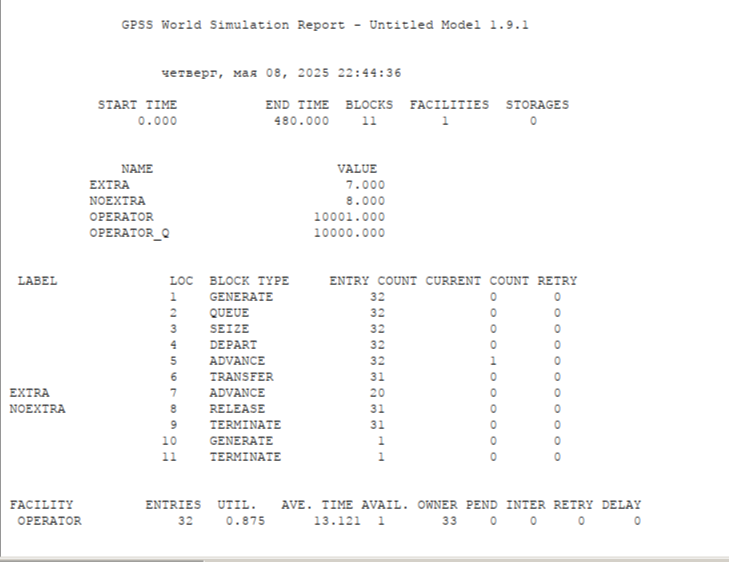{#fig:011 width=85%}

# Модель оформления заказов несколькими операторами

\centering
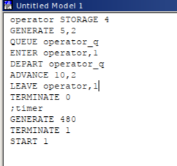{#fig:012 width=85%}

\centering
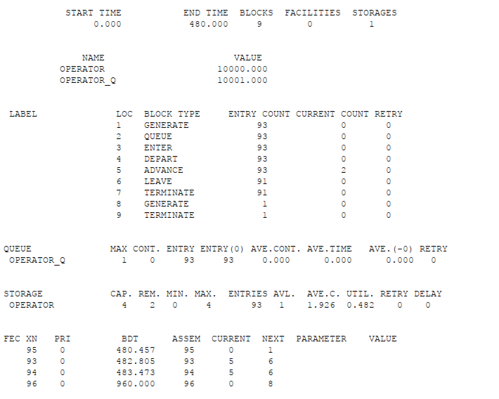{#fig:013 width=85%}

## После изменений 

\centering
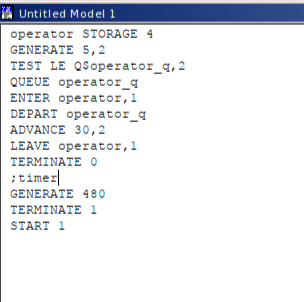{#fig:014 width=85%}

\centering
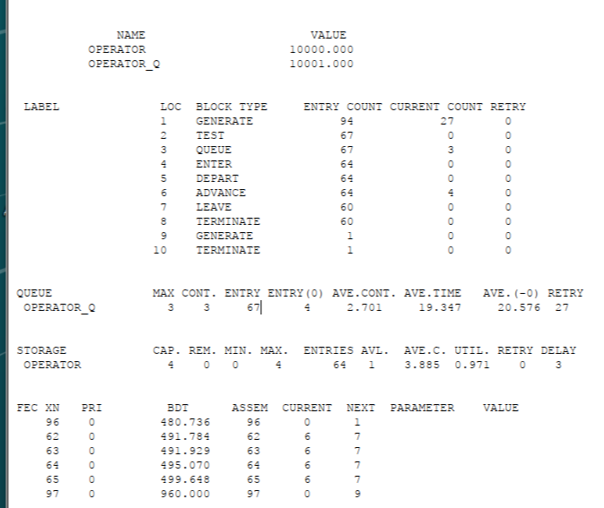{#fig:015 width=85%}

# Сравнение 

Во втором варианте модели не все заявки обработаны, 27 было отвергнуто. Есть очередь, в среднем 2.7 заявок в очереди и обработка 19 секунд. 64 заявки успешно обработано. В первом варианте 93 заявки обработано без очередей.

# Вывод

Реализовал модели обработки заказов в GPSS.