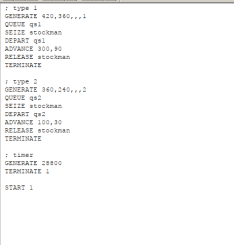
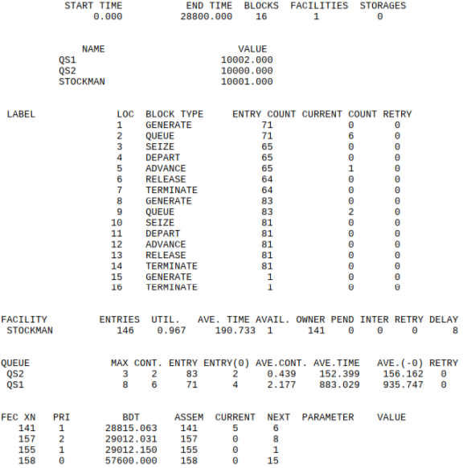
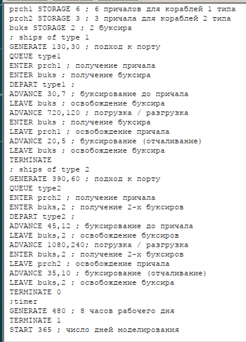
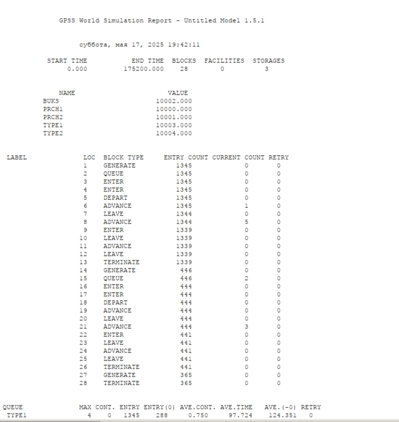

---
## Front matter
lang: ru-RU
title: Лабораторная Работа №15
subtitle: "Модели обслуживанияс приоритетами"
author:
  - Ощепков Дмитрий Владимирович
institute:
  - Российский университет дружбы народов им. Патриса Лумумбы, Москва, Россия

## i18n babel
babel-lang: russian
babel-otherlangs: english

## Formatting pdf
toc: false
toc-title: Содержание
slide_level: 2
aspectratio: 169
section-titles: true
theme: metropolis
header-includes:
 - \metroset{progressbar=frametitle,sectionpage=progressbar,numbering=fraction}
 - '\makeatletter'
 - '\makeatother'

## Fonts
mainfont: Arial
romanfont: Arial
sansfont: Arial
monofont: Arial
---

## Докладчик

  * Ощепков Дмитрий Владимирович 
  * НФИбд-01-22
  * Российский университет дружбы народов
  * [1132226442@pfur.ru]
  
## Цель работы

Реализовать модели обслуживания с приоритетами 

## Задание

На фабрике на складе работает один кладовщик, который выдает запасные части
механикам, обслуживающим станки. Время, необходимое для удовлетворения запроса, зависит от типа запасной части. Запросы бывают двух категорий. Для первой
категории интервалы времени прихода механиков 420 ± 360 сек., время обслуживания — 300 ± 90 сек. Для второй категории интервалы времени прихода механиков
360 ± 240 сек., время обслуживания — 100 ± 30 сек.
Порядок обслуживания механиков кладовщиком такой: запросы первой категории
обслуживаются только в том случае, когда в очереди нет ни одного запроса второй
категории. Внутри одной категории дисциплина обслуживания — «первым пришел –
первым обслужился». Необходимо создать модель работы кладовой, моделирование
выполнять в течение восьмичасового рабочего дня.

## Построение модели

\centering
{#fig:001 width=85%}

## Отчет

\centering
{#fig:002 width=85%}

## Анализ отчета

QS1 (для Type 1):

Максимальная длина очереди: 8 транзактов.

Средняя длина: 2.177.

Среднее время ожидания: 883.029 (очень долго!).

QS2 (для Type 2):

Максимальная длина: 3 транзакта.

Среднее время ожидания: 152.399 (значительно меньше, чем у QS1).

Вывод:

Транзакты Type 1 (с большим временем обслуживания ADVANCE 300,90) создают длинные очереди.

Ресурс STOCKMAN — "узкое место": он почти постоянно занят (UTIL. 0.967).

## Задание

Морские суда двух типов прибывают в порт, где происходит их разгрузка. В порту
есть два буксира, обеспечивающих ввод и вывод кораблей из порта. К первому
типу судов относятся корабли малого тоннажа, которые требуют использования
одного буксира. Корабли второго типа имеют большие размеры, и для их ввода
и вывода из порта требуется два буксира. Из-за различия размеров двух типов
кораблей необходимы и причалы различного размера. Кроме того, корабли имеют
различное время погрузки/разгрузки.
Требуется построить модель системы, в которой можно оценить время ожидания
кораблями каждого типа входа в порт. Время ожидания входа в порт включает время
ожидания освобождения причала и буксира. Корабль, ожидающий освобождения
причала, не обслуживается буксиром до тех пор, пока не будет предоставлен нужный
причал. Корабль второго типа не займёт буксир до тех пор, пока ему не будут
доступны оба буксира.

## Построение модели

\centering
{#fig:003 width=85%}

## Отчет

\centering
{#fig:004 width=85%}

## Анализ отчета

Для Type 1:
Максимальная длина очереди: 4 корабля.

Среднее время ожидания: 97.7 мин.

Всего обработано: 1345 кораблей.

Для Type 2:
Максимальная длина очереди: 4 корабля.

Среднее время ожидания: 352.5 мин (почти 6 часов!).

Всего обработано: 446 кораблей.

Проблема:
Корабли Type 2 ждут в 3.5 раза дольше, чем Type 1.

## Анализ отчета

Причалы (PRCH1 и PRCH2):
Ресурс	Вместимость	Занято	Использование
PRCH1	6	0	97.7%
PRCH2	3	0	98.3%

Вывод:
Причалы работают практически на 100% — это "узкое место".

Буксиры (BUKS):
Использование: 39.3%.

Среднее число занятых: 0.786 из 2.

## Вывод

Реализовал модели обслуживания с приоритетами 