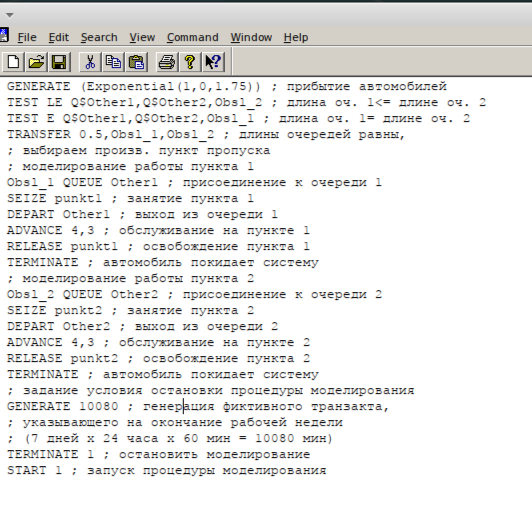
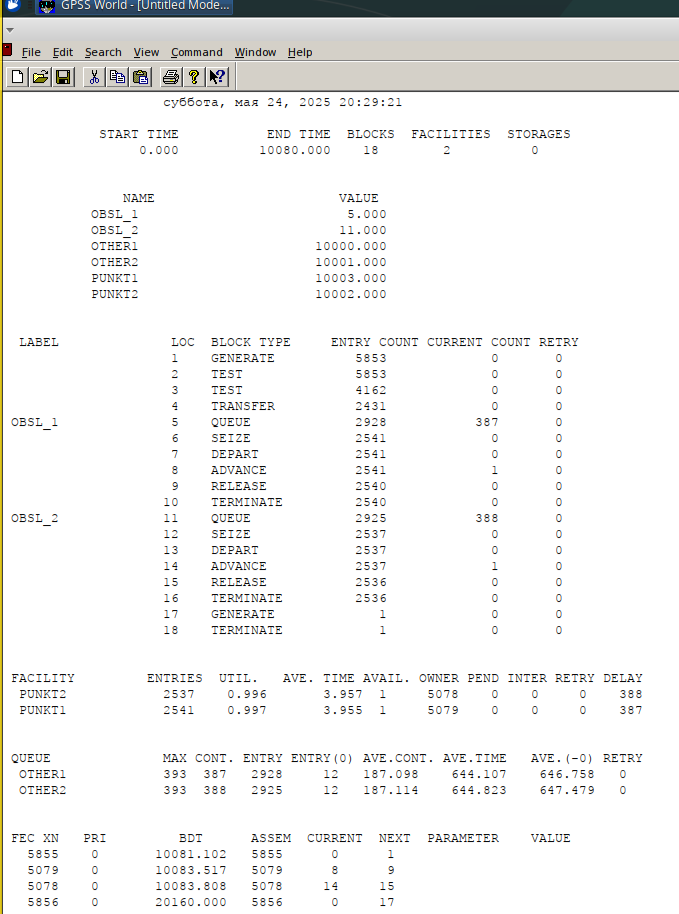
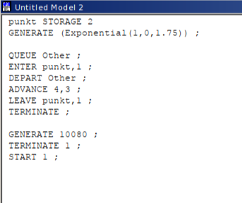
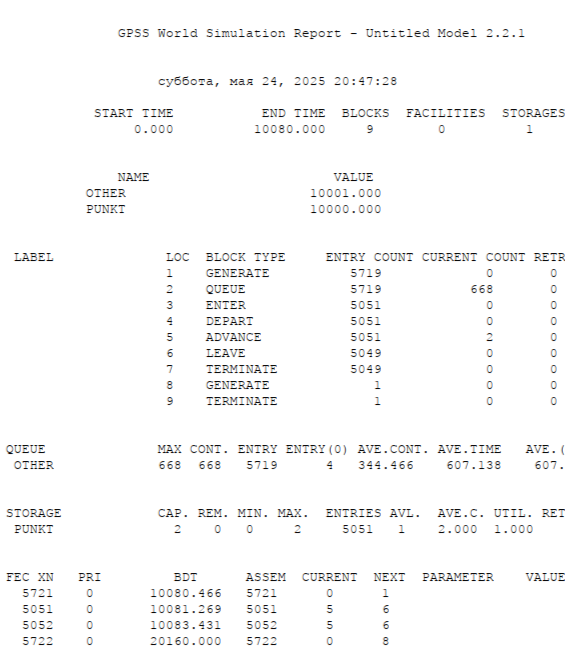
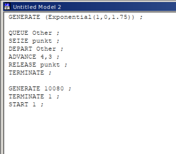
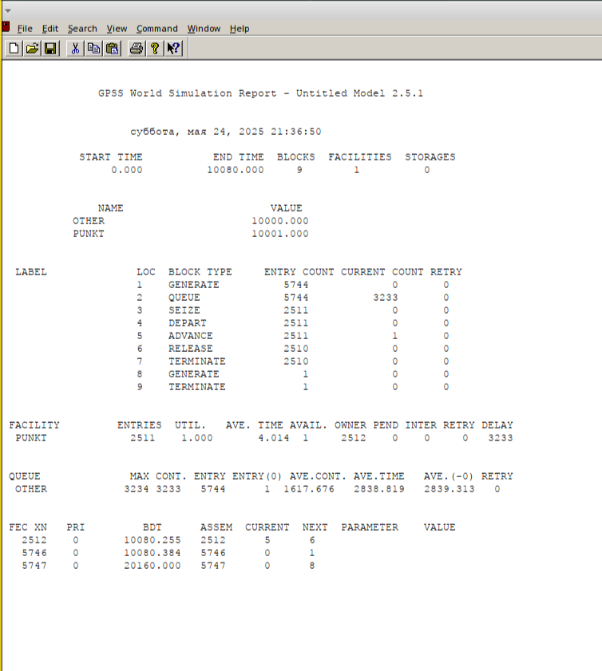
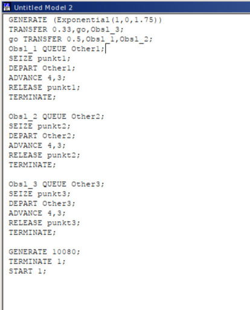
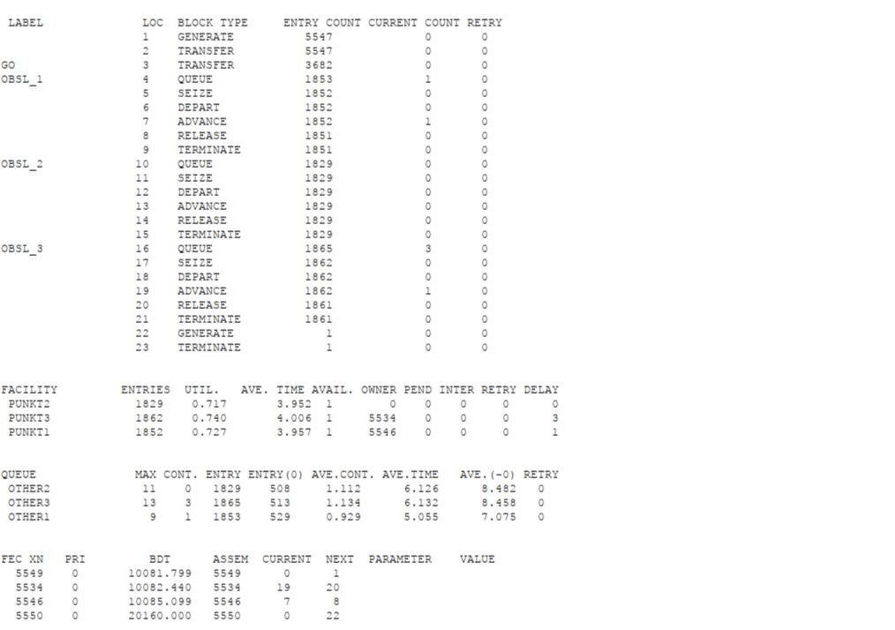
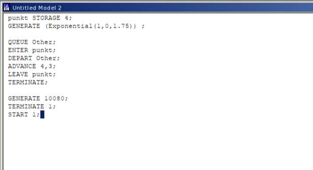
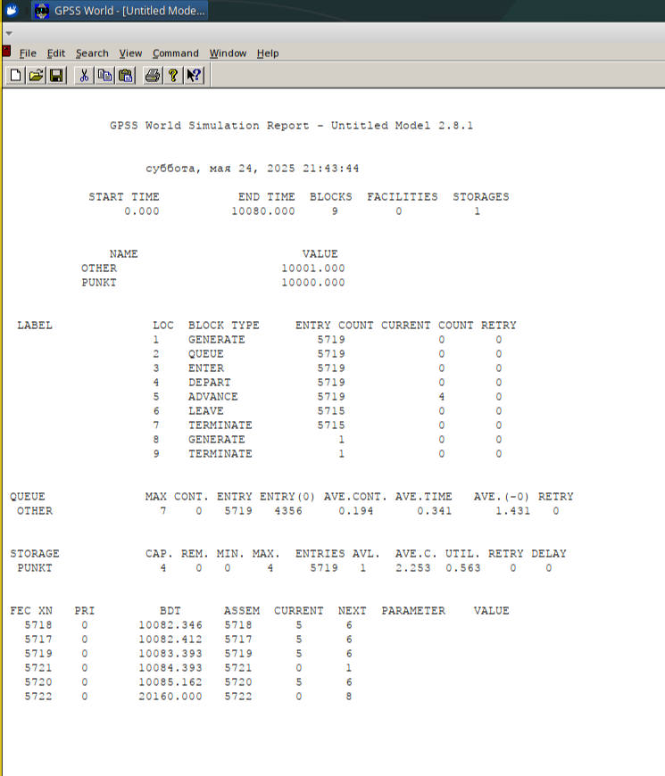

---
## Front matter
lang: ru-RU
title: Лабораторная Работа №16
subtitle: "Задачи оптимизации. Модель двух стратегий обслуживания"
author:
  - Ощепков Дмитрий Владимирович
institute:
  - Российский университет дружбы народов им. Патриса Лумумбы, Москва, Россия

## i18n babel
babel-lang: russian
babel-otherlangs: english

## Formatting pdf
toc: false
toc-title: Содержание
slide_level: 2
aspectratio: 169
section-titles: true
theme: metropolis
header-includes:
 - \metroset{progressbar=frametitle,sectionpage=progressbar,numbering=fraction}
 - '\makeatletter'
 - '\makeatother'

## Fonts
mainfont: Arial
romanfont: Arial
sansfont: Arial
monofont: Arial
---

## Докладчик

  * Ощепков Дмитрий Владимирович 
  * НФИбд-01-22
  * Российский университет дружбы народов
  * [1132226442@pfur.ru]
  
## Цель работы

Реализовать задачи оптимизации модели двух
стратегий обслуживания

## Задание

На пограничном контрольно-пропускном пункте транспорта имеются 2 пункта
пропуска. Интервалы времени между поступлением автомобилей имеют экспоненциальное распределение со средним значением µ. Время прохождения автомобилями
пограничного контроля имеет равномерное распределение на интервале [a, b].
Предлагается две стратегии обслуживания прибывающих автомобилей:
1) автомобили образуют две очереди и обслуживаются соответствующими пунктами
пропуска;
2) автомобили образуют одну общую очередь и обслуживаются освободившимся
пунктом пропуска.
Исходные данные: µ = 1, 75 мин, a = 1 мин, b = 7 мин.

## Построение модели 1

Цельюмоделирования является определение:
характеристик качества обслуживания автомобилей,в частности,средних
длин очередей; среднего времени обслуживания автомобиля; среднего
времени пребывания автомобиля на пункте пропуска;

наилучшейстратегии обслуживания автомобилей на пункте пограничного
контроля;
оптимального количества пропускных пунктов.
Вкачестве критериев,используемыхдля сравнения стратегий обслуживания
автомобилей,выберем:
коэффициентызагрузки системы;
максимальныеисредниедлиныочередей;
средние значения времени ожидания обслуживания.

## Построение модели 1

\centering
{#fig:001 width=85%}

## Построение модели 1

\centering
{#fig:002 width=85%}

## Построение модели 2

Составим модельдля второй стратегии обслуживания,когда прибывающие ав
томобилиобразуютоднуочередьиобслуживаютсяосвободившимсяпропускным
 пунктом 

\centering
{#fig:003 width=85%}

## Построение модели 2

\centering
{#fig:004 width=85%}

## Таблица

 Показатель              | стратегия 1       | стратегия 2       |
|-------------------------|-------------------|-------------------|
|                         | пункт 1 | пункт 2 | в целом | в целом |
| Поступило автомобилей   | 2928    | 2925    | 5853    | 5719    |
| Обслужено автомобилей   | 2540    | 2536    | 5076    | 5049    |
| Коэффициент загрузки    | 0,997   | 0,996   | 0,9965  | 1       |
| Максимальная длина очереди | 393  | 393     | 786     | 668     |
| Средняя длина очереди   | 187,098 | 187,114 | 374,212 | 344,466 |
| Среднее время ожидания  | 644,107 | 644,823 | 644,465 | 607,138 |

## Оптимизация

- среднее время ожидания обслуживания не должно превышать 4 мин

\centering
{#fig:005 width=85%}

## Оптимизация

\centering
{#fig:006 width=85%}

## Оптимизация

- среднее число автомобилей, одновременно находящихся на контрольно-пропускном пункте, не должно превышать 3

\centering
{#fig:007 width=85%}

## Оптимизация

\centering
{#fig:008 width=85%}

## Оптимизация

- коэффициент загрузки пропускных пунктов принадлежит интервалу[0, 5; 0, 95]

\centering
{#fig:009 width=85%}

## Оптимизация

\centering
{#fig:010 width=85%}

## Вывод

Реализованы задачи оптимизации модели двух
стратегий обслуживания
