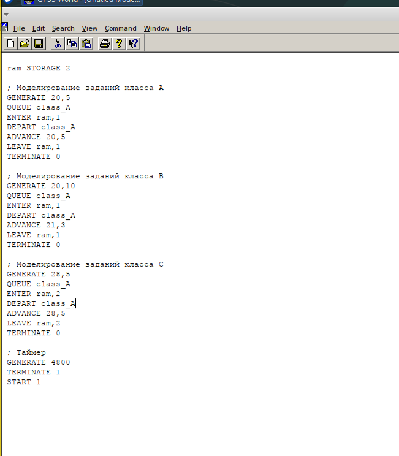
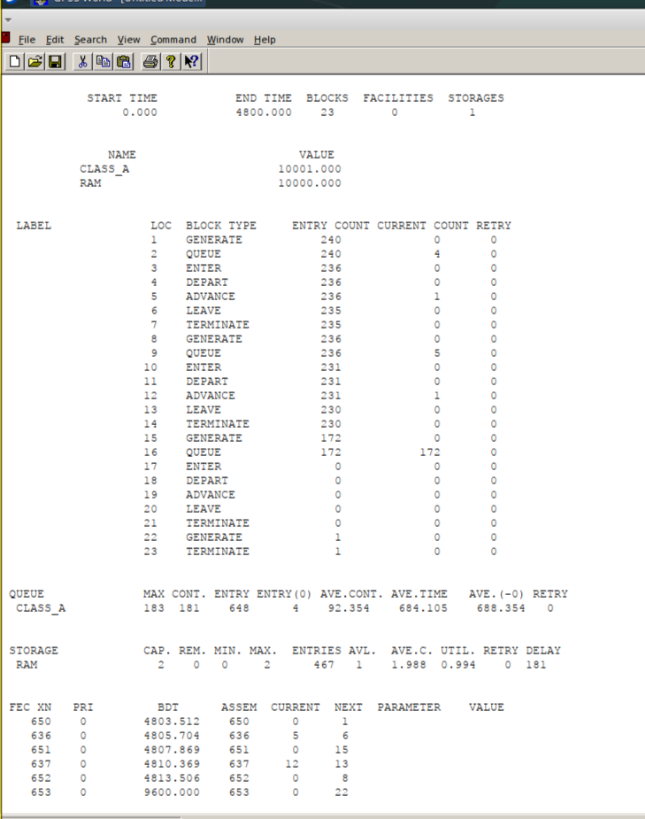
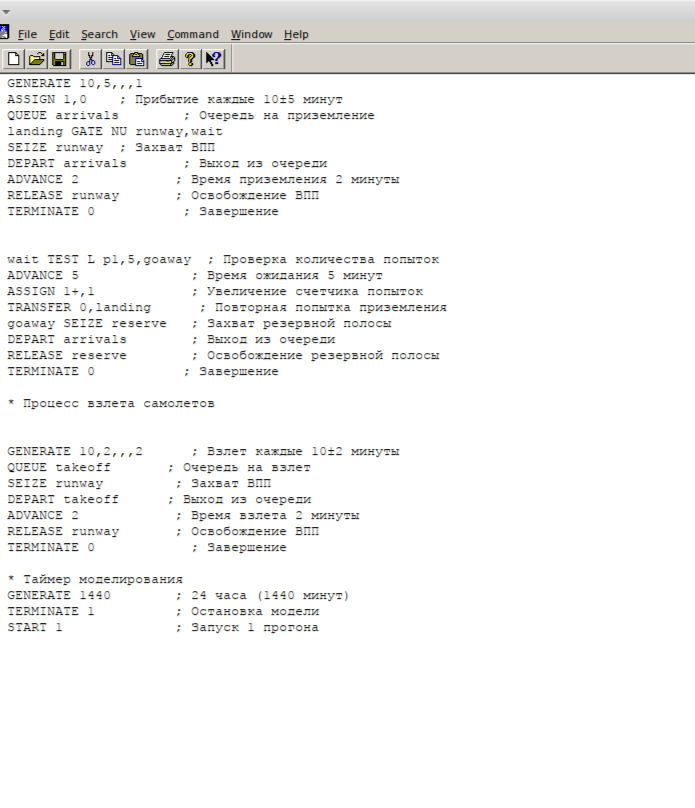
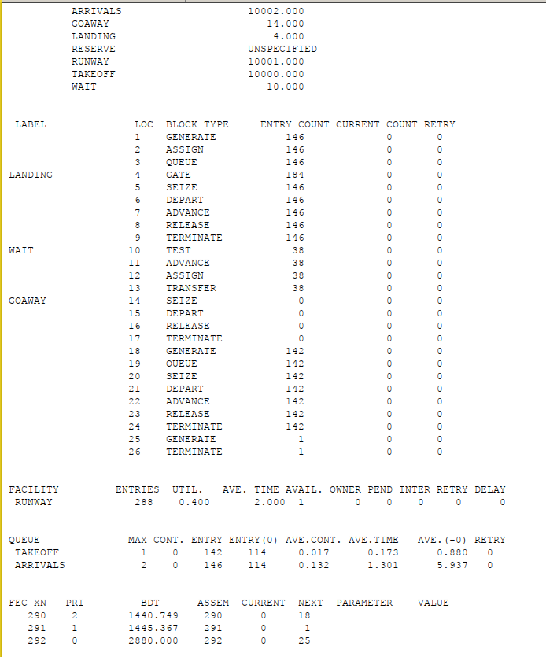
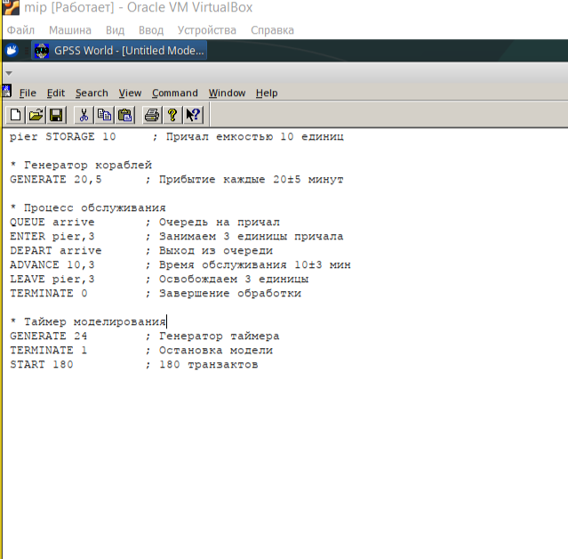
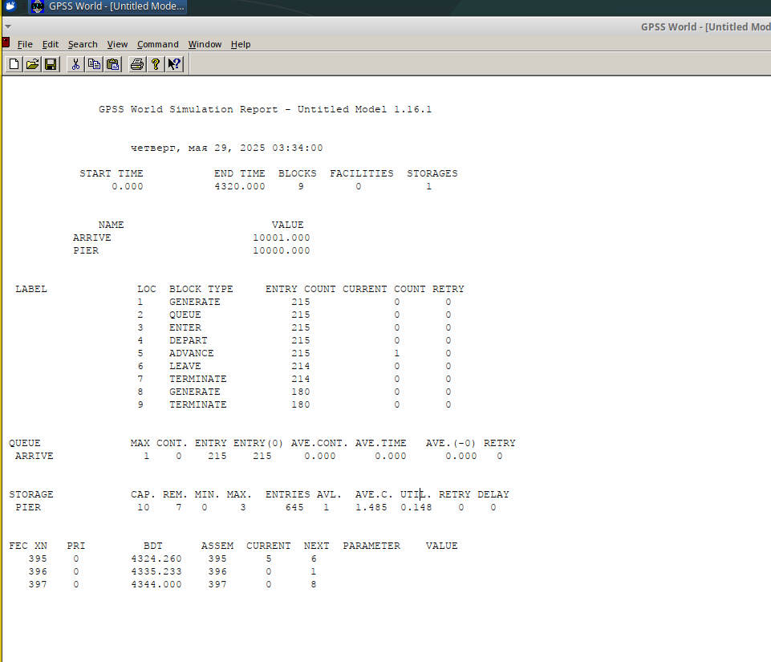
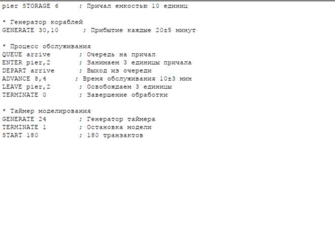
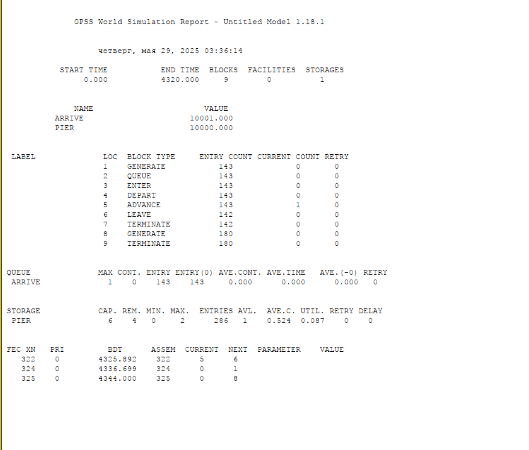

---
## Front matter
title: "Отчёт по лабораторной работе №17"
subtitle: "Самостоятельная работа"
author: "Ощепков Дмитрий Владимирович НФИбд-01-22"
date: \today

## Generic options
lang: ru-RU
toc-title: "Содержание"
fontsize: 12pt
linestretch: 1.5
papersize: a4
documentclass: scrreprt

## Fonts
mainfont: Arial
romanfont: Arial
sansfont: Arial
monofont: Arial

header-includes:
  - \usepackage{indentfirst}
  - \usepackage{float}
  - \floatplacement{figure}{H}
---

# Цель работы

Самостоятельно реализовать три модели 

# Задание №1

На вычислительном центре в обработку принимаются три класса заданий А, В и С.
Исходя из наличия оперативной памяти ЭВМ задания классов А и В могут решаться
одновременно, а задания класса С монополизируют ЭВМ. Задания класса А поступают через 20 ± 5 мин, класса В — через 20 ± 10 мин, класса С — через 28 ± 5 мин
и требуют для выполнения: класс А — 20 ± 5 мин, класс В — 21 ± 3 мин, класс
С — 28 ± 5 мин. Задачи класса С загружаются в ЭВМ, если она полностью свободна.
Задачи классов А и В могут дозагружаться к решающей задаче.
Смоделировать работу ЭВМ за 80 ч. Определить её загрузку

# Построение модели №1

\centering
{#fig:001 width=85%}

Задается хранилище ram на две заявки. Затем записаны три блока: первые два обрабатывают задания класса A и B, используя один элемент ram, а третий обрабатывает задания класса C, используя два элемента ram. Также есть блок времени генерирующий 4800 минут (80 часов).

\centering
{#fig:002 width=85%}

Из отчета увидим, что загруженность системы равна 0.994.

# Задание №2

Самолёты прибывают для посадки в район аэропорта каждые 10 ± 5 мин. Если
взлетно-посадочная полоса свободна, прибывший самолёт получает разрешение на
посадку. Если полоса занята, самолет выполняет полет по кругу и возвращается
в аэропорт каждые 5 мин. Если после пятого круга самолет не получает разрешения
на посадку, он отправляется на запасной аэродром.
В аэропорту через каждые 10 ± 2 мин к взлетно-посадочной полосе выруливают
готовые к взлёту самолёты и получают разрешение на взлёт, если полоса свободна.
Для взлета и посадки самолёты занимают полосу ровно на 2 мин. Если при свободной
полосе одновременно один самолёт прибывает для посадки, а другой — для взлёта,
то полоса предоставляется взлетающей машине.
Требуется:
– выполнить моделирование работы аэропорта в течение суток;
– подсчитать количество самолётов, которые взлетели, сели и были направлены на
запасной аэродром;
– определить коэффициент загрузки взлетно-посадочной полосы.

# Построение модели №2

\centering
{#fig:003 width=85%}

Блок для влетающих самолетов имеет приоритет 2, для прилетающий приоритет 1 (чем выше значение, тем выше приоритет). Происходит проверка: если полоса пустая, то заявка просто отрабатывается, если нет, то происходит переход в блок ожидания. При ожидании заявка проходит в цикле 5 раз, каждый раз проверяется не освободилась ли полоса, если освободилась -- переход в блок обработки, если нет -- самолет обрабатывается дополнительным обработчиком отправления в запасной аэродром. Время задаем в минутах -- 1440 (24 часа).

\centering
{#fig:004 width=85%}

Взлетело 142 самолета, село 146, а в запасной аэропорт отправилось 0. В запасной аэропорт не отправились самолеты, поскольку процессы обработки длятся всего 2 минуты, что намного быстрее, чем генерации новых самолетов. Коэффициент загрузки полосы равняется 0.4, полоса большую часть времени не используется.

# Задание №3

Морские суда прибывают в порт каждые [a ± δ] часов. В порту имеется N причалов.
Каждый корабль по длине занимает M причалов и находится в порту [b ± ε] часов.
Требуется построить GPSS-модель для анализа работы морского порта в течение
полугода, определить оптимальное количество причалов для эффективной работы
порта.
Исходные данные:
1) a = 20 ч, δ = 5 ч, b = 10 ч, ε = 3 ч, N = 10, M = 3;
2) a = 30 ч, δ = 10 ч, b = 8 ч, ε = 4 ч, N = 6, M = 2.

# a = 20 ч, δ = 5 ч, b = 10 ч, ε = 3 ч, N = 10, M = 3

\centering
{#fig:005 width=85%}

\centering
{#fig:006 width=85%}

# a = 30 ч, δ = 10 ч, b = 8 ч, ε = 4 ч, N = 6, M = 2

\centering
{#fig:007 width=85%}

\centering
{#fig:008 width=85%}

В обоих случаях сильный недогруз причало, что неэффекивно, можно снизить до 2-3 причалов!

# Вывод

Самостоятельно реализовал три модели 