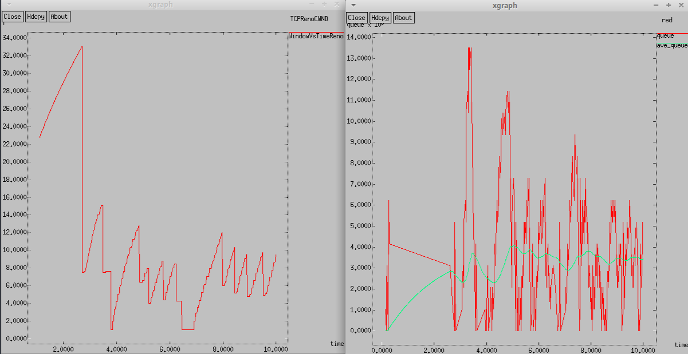
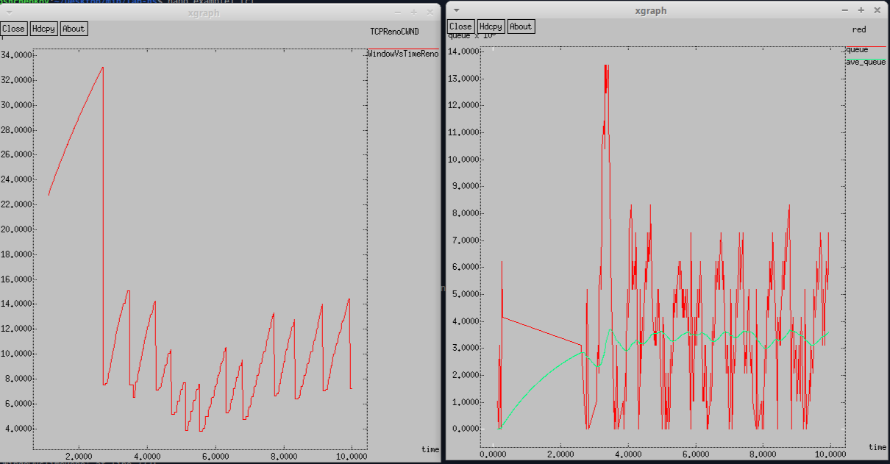
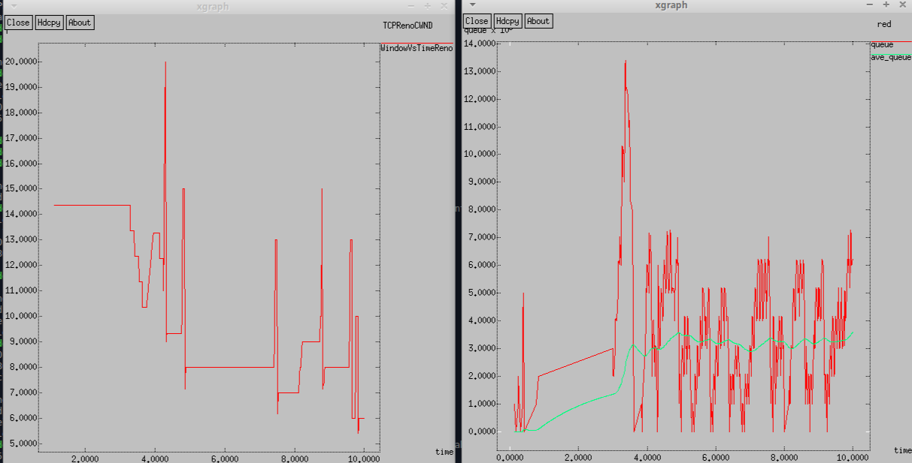
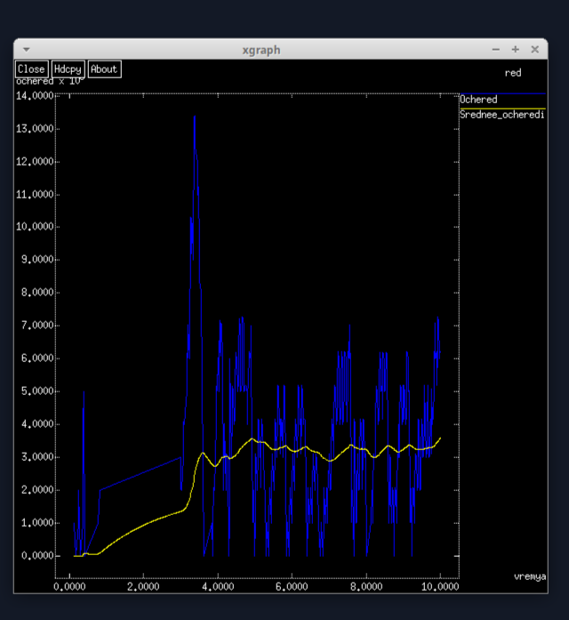

---
## Front matter
lang: ru-RU
title: Лабораторная Работа №2
subtitle: Исследование протокола TCP и алгоритма управления очередью RED
author:
  - Ощепков Дмитрий Владимирович
institute:
  - Российский университет дружбы народов им. Патриса Лумумбы, Москва, Россия

## i18n babel
babel-lang: russian
babel-otherlangs: english

## Formatting pdf
toc: false
toc-title: Содержание
slide_level: 2
aspectratio: 169
section-titles: true
theme: metropolis
header-includes:
 - \metroset{progressbar=frametitle,sectionpage=progressbar,numbering=fraction}
 - '\makeatletter'
 - '\makeatother'

## Fonts
mainfont: Arial
romanfont: Arial
sansfont: Arial
monofont: Arial
---

## Докладчик

  * Ощепков Дмитрий Владимирович 
  * НФИбд-01-22
  * Российский университет дружбы народов
  * [1132226442@pfur.ru]
  
# Выполнение лабораторной работы

## Цель работы

# Цель работы

Исследование протокола TCP и алгоритма управления очередью RED.

# Задание

Постановка задачи Описание моделируемой сети:
– сеть состоит из 6 узлов;
– между всеми узлами установлено дуплексное соединение с различными пропускной способностью и задержкой 10 мс (см. рис. 2.4);
– узел r1 использует очередь с дисциплиной RED для накопления пакетов, максимальный размер которой составляет 25;
– TCP-источники на узлах s1 и s2 подключаются к TCP-приёмнику на узле s3;
– генераторы трафика FTP прикреплены к TCP-агентам.
На рис. 2.4 приведена схема моделируемой сети.
Требуется разработать сценарий, реализующий модель согласно рис. 2.4, построить в Xgraph график изменения TCP-окна, график изменения длины очереди
и средней длины очереди.

Потом выполнить упражнение:
– Измените в модели на узле s1 тип протокола TCP с Reno на NewReno, затем на
Vegas. Сравните и поясните результаты.
– Внесите изменения при отображении окон с графиками (измените цвет фона,
цвет траекторий, подписи к осям, подпись траектории в легенде).

# Выполнение лабораторной работы

Выполним построение сети в соответствии с описанием:

сеть состоит из 6 узлов;
между всеми узлами установлено дуплексное соединение с различными пропускной способностью и задержкой 10 мс;
узел r1 использует очередь с дисциплиной RED для накопления пакетов, максимальный размер которой составляет 25;
TCP-источники на узлах s1 и s2 подключаются к TCP-приёмнику на узле s3;
генераторы трафика FTP прикреплены к TCP-агентам.
Теперь разработаем сценарий, реализующий модель согласно описанию, чтобы построить в Xgraph график изменения TCP-окна, график изменения длины очереди и средней длины очереди. (рис. [-@fig:001])

## Вывод программы
{ #fig:001 width=70% }

По графику видно, что средняя длина очереди находится в диапазоне от 2 до 4. Максимальная длина достигает значения 14.

## Изменение протокола TCP (рис. [-@fig:002])

{ #fig:002 width=70% }
Так же, как было в графике с типом Reno значение средней длины очереди находится в пределах от 2 до 4, а максимальное значение длины равно 14. Графики достаточно похожи. В обоих алгоритмах размер окна увеличивается до тех пор, пока не произойдёт потеря сегмента.

## Изменение протокола TCP (рис. [-@fig:003])

{ #fig:003 width=70% }

## Поменял вид визуализации (рис. [-@fig:004])

{ #fig:004 width=70% }

## Выводы

Исследовал протокола TCP и алгоритма управления очередью RED.
