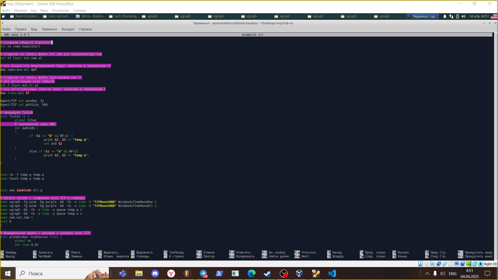
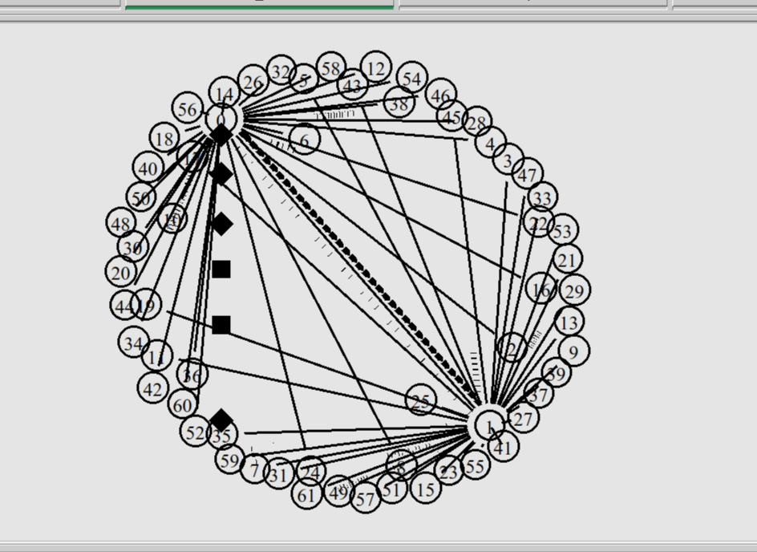
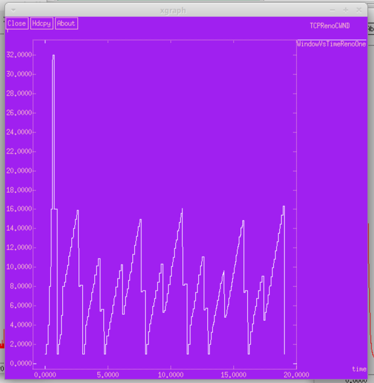
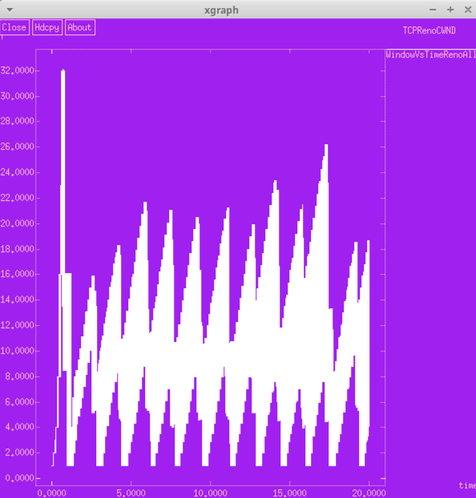
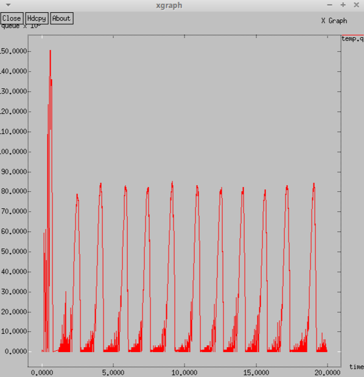
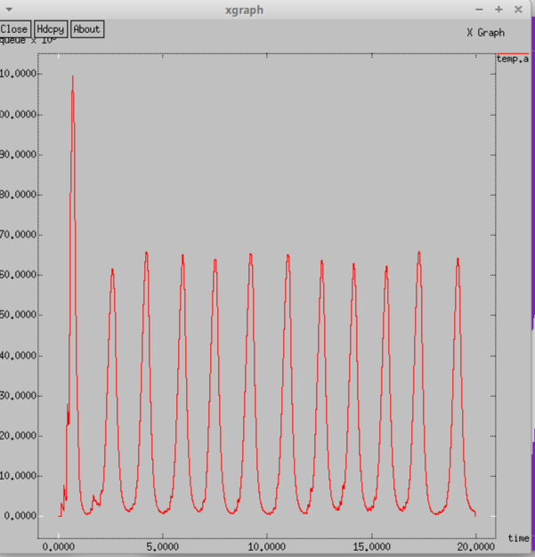

---
## Front matter
lang: ru-RU
title: Лабораторная работа 4
subtitle: "Задание для самостоятельного выполнения"
author:
  - Ощепков Дмитрий Владимирович
institute:
  - Российский университет дружбы народов им. Патриса Лумумбы, Москва, Россия

## i18n babel
babel-lang: russian
babel-otherlangs: english

## Formatting pdf
toc: false
toc-title: Содержание
slide_level: 2
aspectratio: 169
section-titles: true
theme: metropolis
header-includes:
 - \metroset{progressbar=frametitle,sectionpage=progressbar,numbering=fraction}
 - '\makeatletter'
 - '\makeatother'

## Fonts
mainfont: Arial
romanfont: Arial
sansfont: Arial
monofont: Arial
---

## Докладчик

  * Ощепков Дмитрий Владимирович 
  * НФИбд-01-22
  * Российский университет дружбы народов
  * [1132226442@pfur.ru]
  
## Цель работы

Самостоятельно реализовать модель

## Задание

Описание моделируемой сети:
– сеть состоит из N TCP-источников, N TCP-приёмников, двух маршрутизаторов
R1 и R2 между источниками и приёмниками (N — не менее 20);
– между TCP-источниками и первым маршрутизатором установлены дуплексные
соединения с пропускной способностью 100 Мбит/с и задержкой 20 мс очередью
типа DropTail;
– между TCP-приёмниками и вторым маршрутизатором установлены дуплексные
соединения с пропускной способностью 100 Мбит/с и задержкой 20 мс очередью
типа DropTail;
– между маршрутизаторами установлено симплексное соединение (R1–R2) с пропускной способностью 20 Мбит/с и задержкой 15 мс очередью типа RED,
размером буфера 300 пакетов; в обратную сторону — симплексное соединение (R2–R1) с пропускной способностью 15 Мбит/с и задержкой 20 мс очередью
типа DropTail;
– данные передаются по протоколу FTP поверх TCPReno;
– параметры алгоритма RED: qmin = 75, qmax = 150, qw = 0, 002, pmax = 0.1;
– максимальный размер TCP-окна 32; размер передаваемого пакета 500 байт; время
моделирования — не менее 20 единиц модельного времени.

## Выполнение лабораторной работы

{ #fig:001 width=70% }

## Схема модели

{ #fig:002 width=70% }

## Изменение размера окна TCP на линке 1-го источника при N=30

{ #fig:003 width=70% }

## Изменение размера окна TCP на всех источниках при N=30

{ #fig:004 width=70% }

## Изменение размера длины очереди на линке (R1–R2) при N=30, qmin = 75, qmax = 150

{#fig:005 width=70% }

## Изменение размера средней длины очереди на линке (R1–R2) при N=30, qmin = 75, qmax = 150

{ #fig:006 width=70% }

## Выводы

Самостоятельно реализовал модель в NS-2