---
## Front matter
lang: ru-RU
title: Лабораторная Работа №5
subtitle: " Модель эпидемии (SIR)"
author:
  - Ощепков Дмитрий Владимирович
institute:
  - Российский университет дружбы народов им. Патриса Лумумбы, Москва, Россия

## i18n babel
babel-lang: russian
babel-otherlangs: english

## Formatting pdf
toc: false
toc-title: Содержание
slide_level: 2
aspectratio: 169
section-titles: true
theme: metropolis
header-includes:
 - \metroset{progressbar=frametitle,sectionpage=progressbar,numbering=fraction}
 - '\makeatletter'
 - '\makeatother'

## Fonts
mainfont: Arial
romanfont: Arial
sansfont: Arial
monofont: Arial
---

## Докладчик

  * Ощепков Дмитрий Владимирович 
  * НФИбд-01-22
  * Российский университет дружбы народов
  * [1132226442@pfur.ru]
  
# Цель работы

Построить модель SIR в xcos и OpenModelica.

# Задание

Реализовать модель SIR в в xcos;
Реализовать модель SIR с помощью блока Modelica в в xcos;
Реализовать модель SIR в OpenModelica;
Реализовать модель SIR с учётом процесса рождения / гибели особей в xcos (в том числе и с использованием блока Modelica), а также в OpenModelica;
Построить графики эпидемического порога при различных значениях параметров модели (в частности изменяя параметр 
μ
);
Сделать анализ полученных графиков в зависимости от выбранных значений параметров модели.

# Выполнение лабораторной работы

Открыл Scilab, там открыл xcos

Зафиксируем начальные данные: β = 1, ν = 0, 3, s(0) = 0, 999, i(0) = 0, 001,
r(0) = 0.

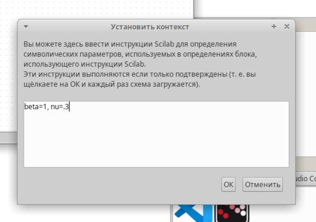{ #fig:001 width=70% }

## Собрал схему

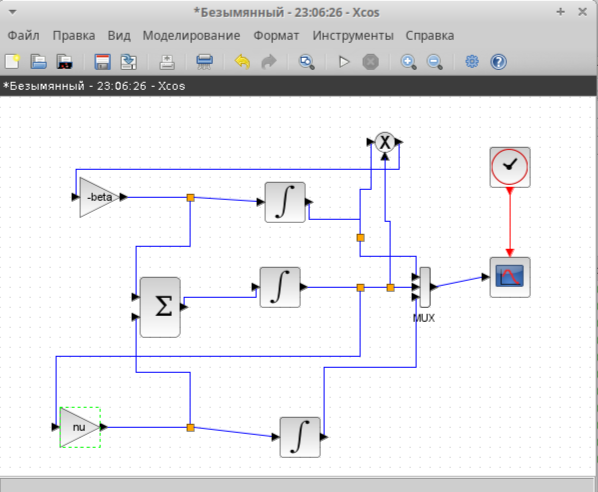{ #fig:002 width=70% }

## Настраиваю блоки 

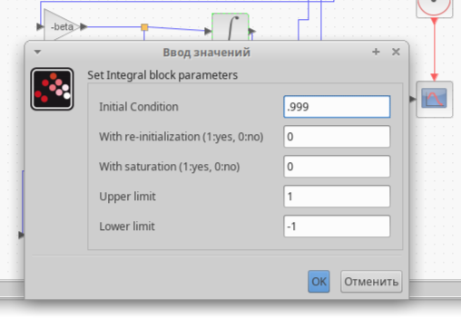{ #fig:003 width=70% }

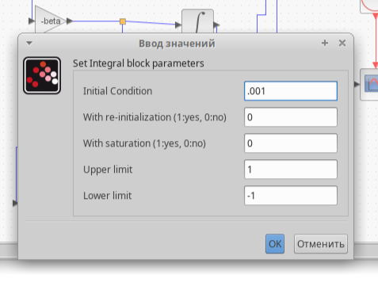{ #fig:004 width=70% }

## Настройки
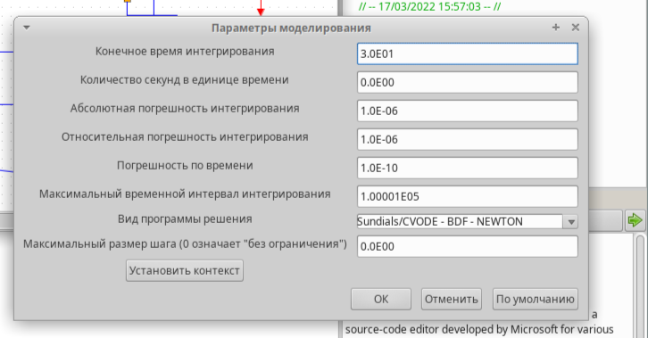{ #fig:005 width=70% }

## Вывод программы 
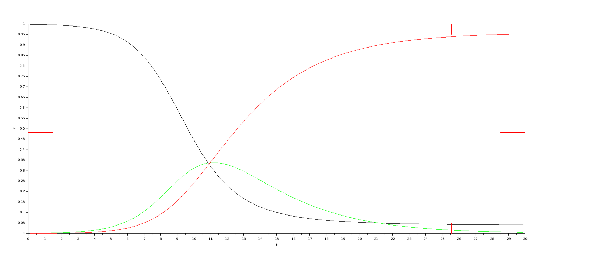{ #fig:006 width=70% }

## Реализация модели с помощью блока Modelica в xcos

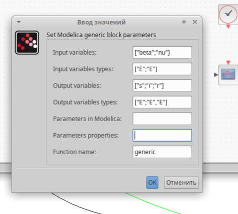{ #fig:007 width=70% }

## Настройки
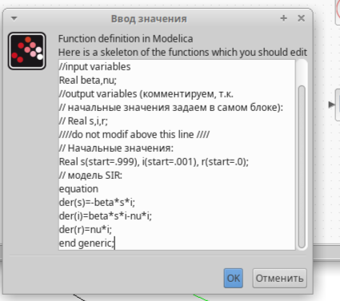{ #fig:008 width=70% }

## Модель SIR в xcos с применением блока Modelica
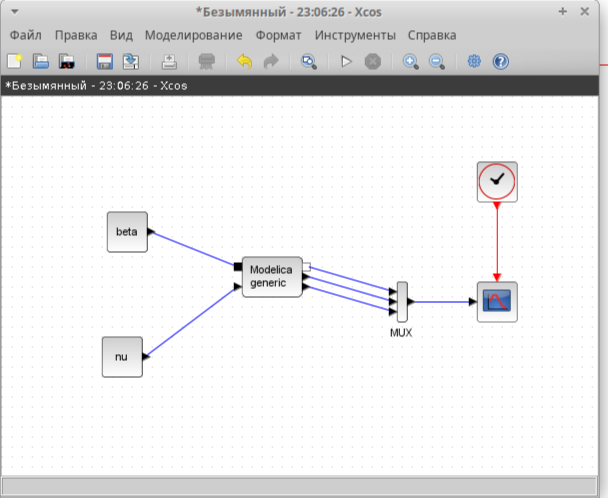{ #fig:009 width=70% }

## Эпидемический порог модели SIR 5.1 при β = 1, ν = 0.3
{ #fig:010 width=70% }

## Задание для самостоятельного выполнения
 Предположим, что в модели SIR учитываются демографические процессы, в частности, что смертность в популяции полностью уравновешивает рождаемость, а все рожденные индивидуумы появляются на свет абсолютно здоровыми. 

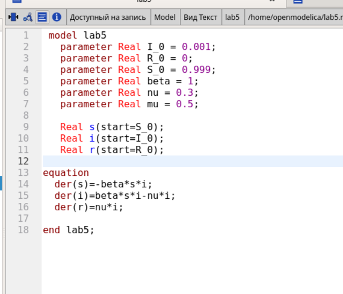{ #fig:011 width=70% }
## Вывод

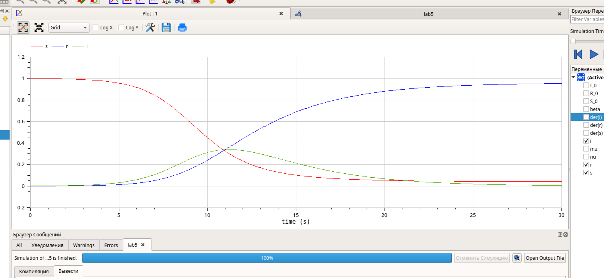{ #fig:012 width=70% }

## Схема
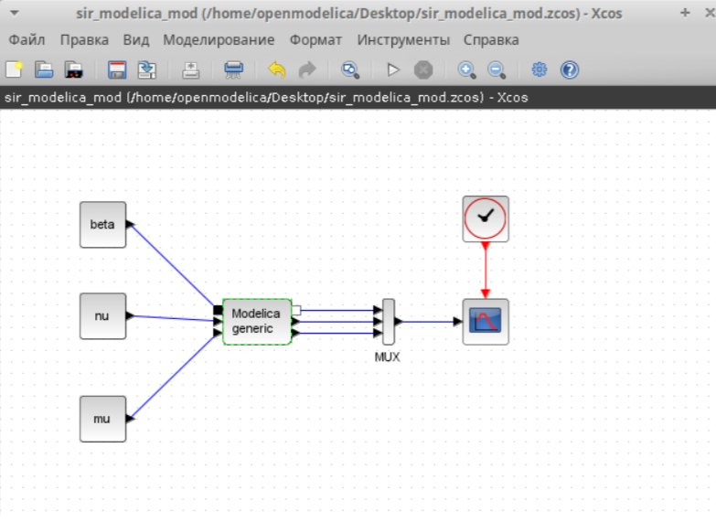{ #fig:013 width=70% }

## Код Modelica
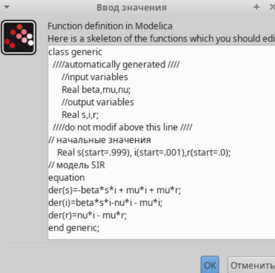{ #fig:014 width=70% }

## Вывод программы
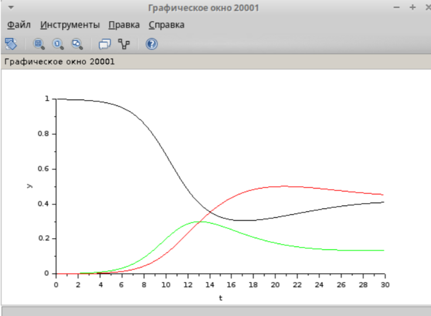{ #fig:015 width=70% }

# Выводы

В процессе выполнения данной лабораторной работы была построена модель SIR в xcos и OpenModelica.
