---
## Front matter
title: "Отчёт по лабораторной работе №5"
subtitle: " Модель эпидемии (SIR)"
author: "Ощепков Дмитрий Владимирович НФИбд-01-22"

## Generic otions
lang: ru-RU
toc-title: "Содержание"

## Bibliography
bibliography: bib/cite.bib
csl: pandoc/csl/gost-r-7-0-5-2008-numeric.csl

## Pdf output format
toc: true # Table of contents
toc-depth: 2
lof: true # List of figures
lot: true # List of tables
fontsize: 12pt
linestretch: 1.5
papersize: a4
documentclass: scrreprt
## I18n polyglossia
polyglossia-lang:
  name: russian
polyglossia-otherlangs:
  name: english
## I18n babel
babel-lang: russian
babel-otherlangs: english
## Fonts
mainfont: Arial
romanfont: Arial
sansfont: Arial
monofont: Arial
mainfontoptions: Ligatures=TeX
romanfontoptions: Ligatures=TeX
sansfontoptions: Ligatures=TeX,Scale=MatchLowercase
monofontoptions: Scale=MatchLowercase,Scale=0.9
## Biblatex
biblatex: true
biblio-style: "gost-numeric"
biblatexoptions:
  - parentracker=true
  - backend=biber
  - hyperref=auto
  - language=auto
  - autolang=other*
  - citestyle=gost-numeric
## Pandoc-crossref LaTeX customization
figureTitle: "Рис."
tableTitle: "Таблица"
listingTitle: "Листинг"
lofTitle: "Список иллюстраций"
lotTitle: "Список таблиц"
lolTitle: "Листинги"
## Misc options
indent: true
header-includes:
  - \usepackage{indentfirst}
  - \usepackage{float} # keep figures where there are in the text
  - \floatplacement{figure}{H} # keep figures where there are in the text
---

# Цель работы

Построить модель SIR в xcos и OpenModelica.

# Задание

Реализовать модель SIR в в xcos;
Реализовать модель SIR с помощью блока Modelica в в xcos;
Реализовать модель SIR в OpenModelica;
Реализовать модель SIR с учётом процесса рождения / гибели особей в xcos (в том числе и с использованием блока Modelica), а также в OpenModelica;
Построить графики эпидемического порога при различных значениях параметров модели (в частности изменяя параметр 
μ
);
Сделать анализ полученных графиков в зависимости от выбранных значений параметров модели.

# Выполнение лабораторной работы

Открыл Scilab, там открыл xcos

Зафиксируем начальные данные: β = 1, ν = 0, 3, s(0) = 0, 999, i(0) = 0, 001,
r(0) = 0.

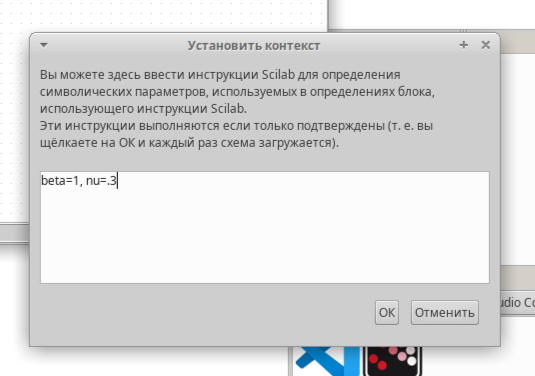{ #fig:001 width=70% }

Собрал схему

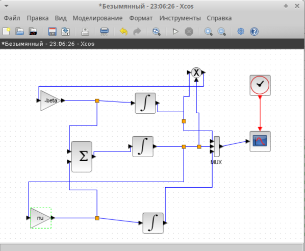{ #fig:002 width=70% }

Настраиваю блоки (рис. [-@fig:003])

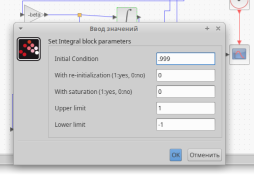{ #fig:003 width=70% }

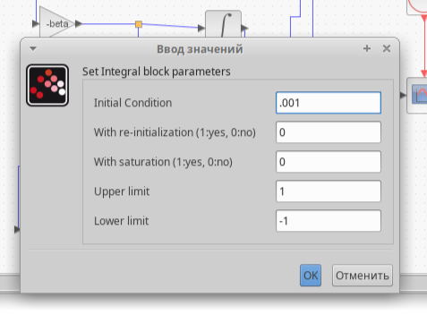{ #fig:004 width=70% }

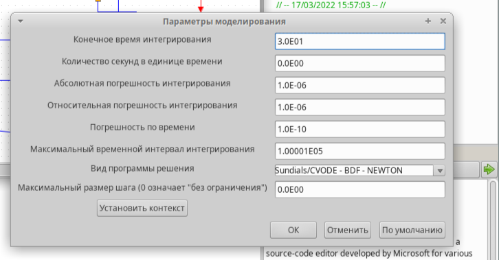{ #fig:005 width=70% }

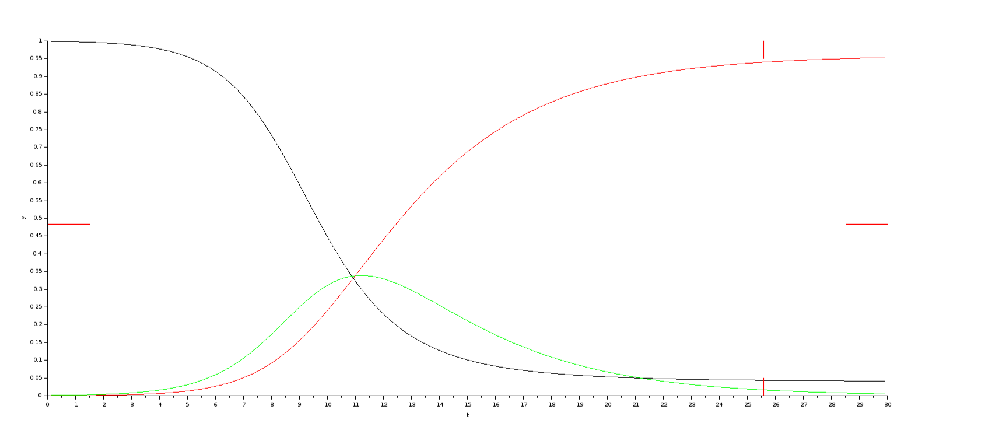{ #fig:006 width=70% }

 # Реализация модели с помощью блока Modelica в xcos

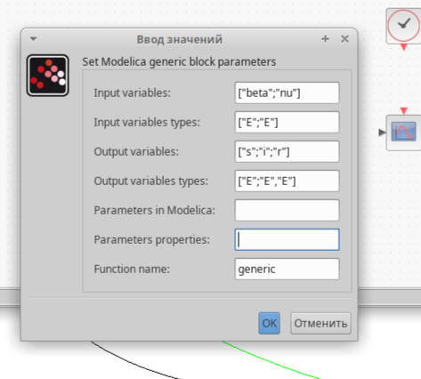{ #fig:007 width=70% }

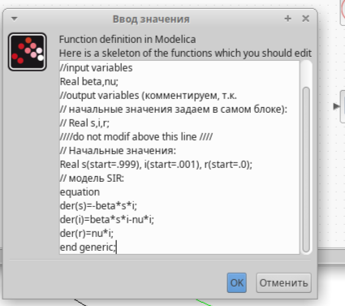{ #fig:008 width=70% }

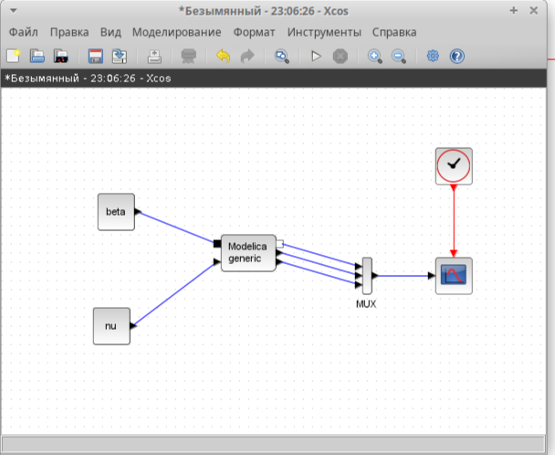{ #fig:009 width=70% }

{ #fig:010 width=70% }

Задание для самостоятельного выполнения
 Предположим, что в модели SIR учитываются демографические процессы, в частности, что смертность в популяции полностью уравновешивает рождаемость, а все рожденные индивидуумы появляются на свет абсолютно здоровыми. 

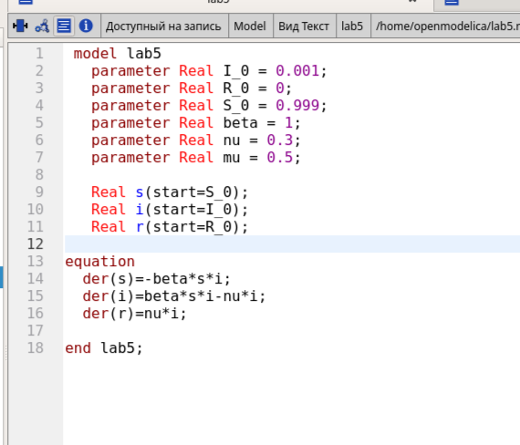{ #fig:011 width=70% }

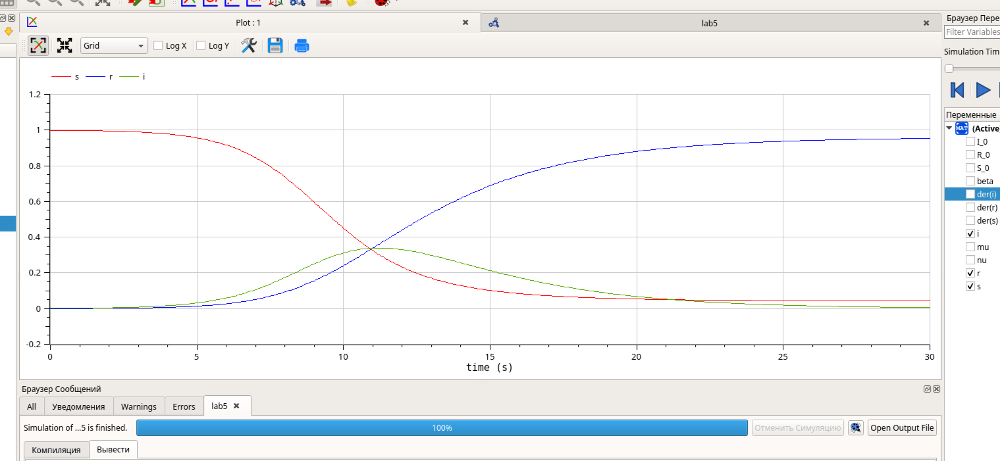{ #fig:012 width=70% }

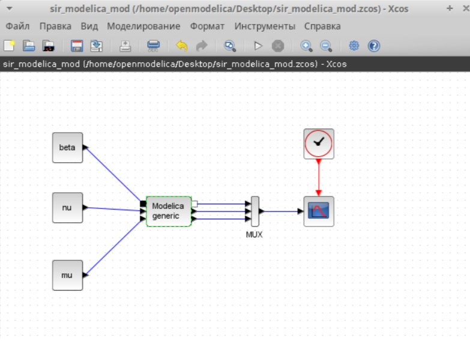{ #fig:013 width=70% }

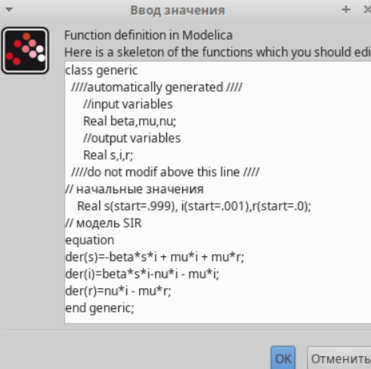{ #fig:014 width=70% }

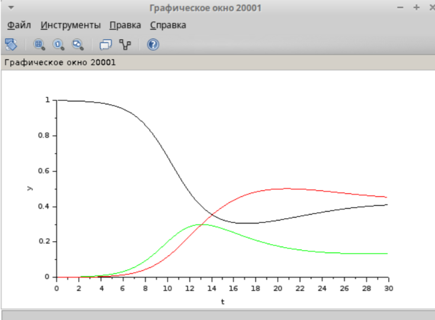{ #fig:015 width=70% }

# Выводы

В процессе выполнения данной лабораторной работы была построена модель SIR в xcos и OpenModelica.