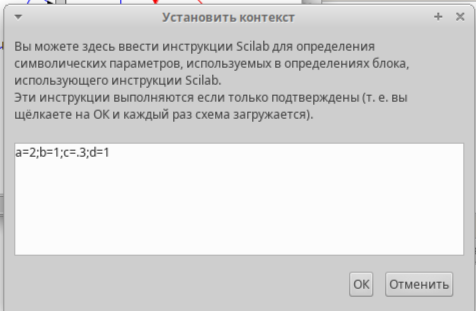
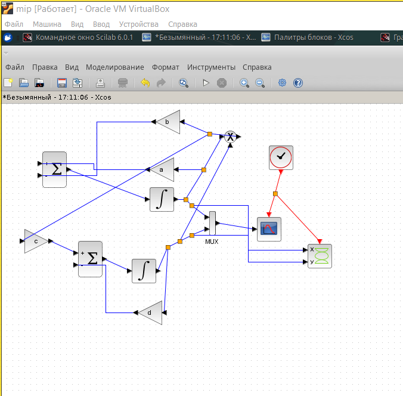
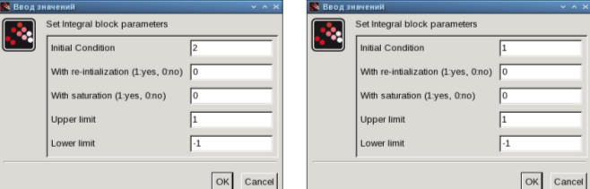
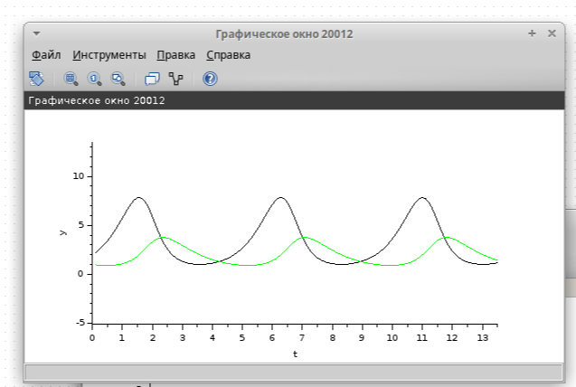
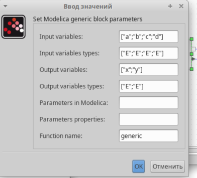
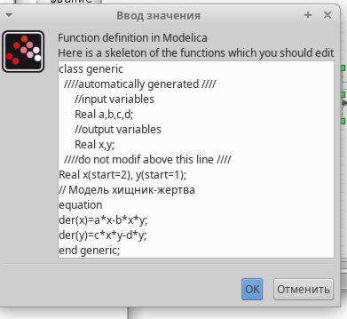
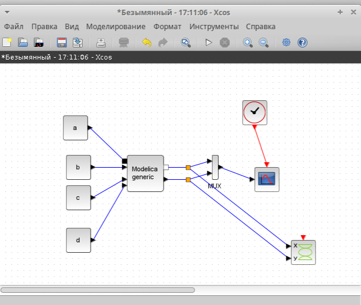
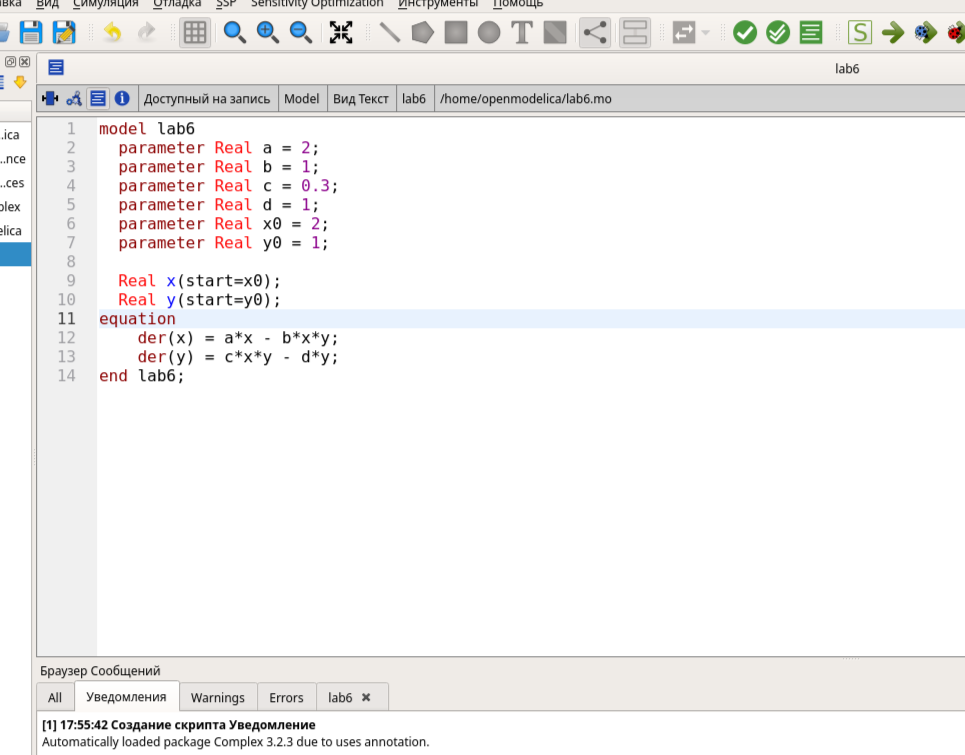
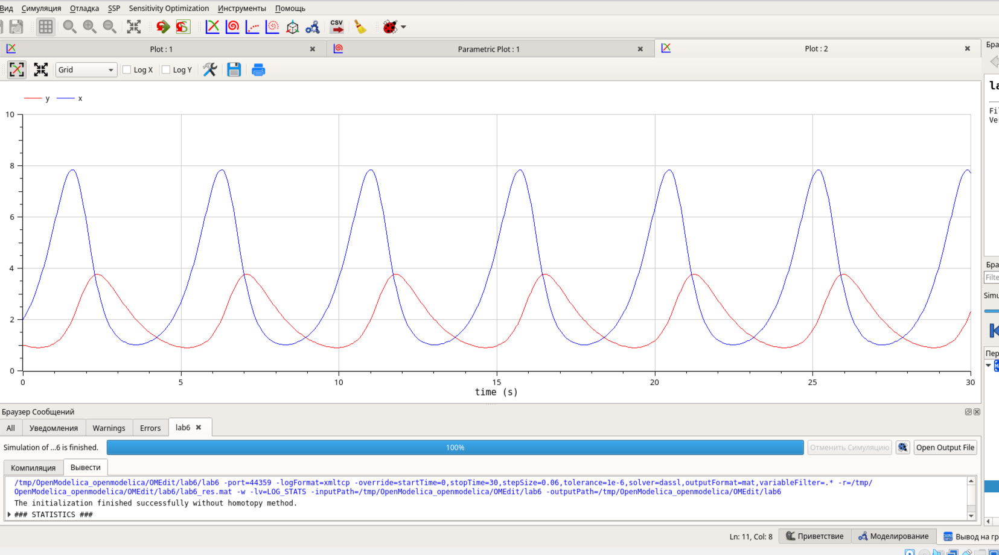
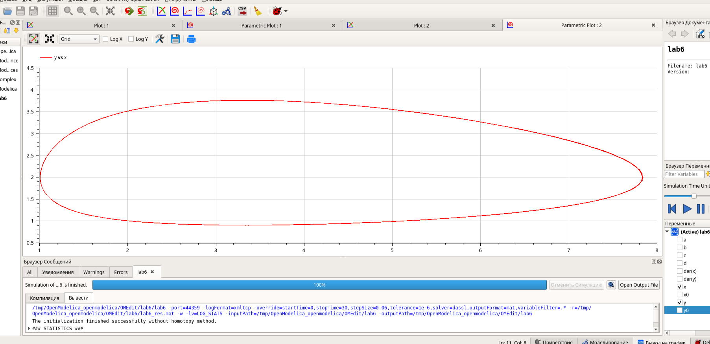

---
## Front matter
lang: ru-RU
title: Лабораторная Работа №6
subtitle: " Модель «хищник–жертва»"
author:
  - Ощепков Дмитрий Владимирович
institute:
  - Российский университет дружбы народов им. Патриса Лумумбы, Москва, Россия

## i18n babel
babel-lang: russian
babel-otherlangs: english

## Formatting pdf
toc: false
toc-title: Содержание
slide_level: 2
aspectratio: 169
section-titles: true
theme: metropolis
header-includes:
 - \metroset{progressbar=frametitle,sectionpage=progressbar,numbering=fraction}
 - '\makeatletter'
 - '\makeatother'

## Fonts
mainfont: Arial
romanfont: Arial
sansfont: Arial
monofont: Arial
---

## Докладчик

  * Ощепков Дмитрий Владимирович 
  * НФИбд-01-22
  * Российский университет дружбы народов
  * [1132226442@pfur.ru]
  
# Цель работы

Реализовать модель "хищник-жертва" в xcos.

# Задание

Реализовать модель "хищник-жертва" в xcos;
Реализовать модель "хищник-жертва" с помощью блока Modelica в xcos;
Реализовать модель "хищник-жертва" в OpenModelica

## Выполнение лабораторной работы

Открыл Scilab, там открыл xcos

Зафиксируем начальные данные: a = 2, b = 1, c = 0, 3, d = 1, x(0) = 2, y(0) = 1.
В меню Моделирование, Задать переменные окружения зададим значения коэффициентов a, b, c, d (рис. 6.1).

## Настройка

{ #fig:001 width=70% }

## Собрал схему

{ #fig:002 width=70% }

## Задал значения в блоках интегрирования

{ #fig:003 width=70% }

## Вывод

{ #fig:004 width=70% }

 # Реализация модели с помощью блока Modelica в xcos

{ #fig:005 width=70% }

## Параметры блока Modelica для модели

{ #fig:006 width=70% }

## Модель в xcos с применением блока Modelica

{ #fig:007 width=70% }

## Вывод 

{ #fig:008 width=70% }

## Самостоятельная работа

Упражнение. Реализуйте модель «хищник – жертва» в OpenModelica. Постройте
графики изменения численности популяций и фазовый портрет.

{ #fig:09 width=70% }

## Вывод

{ #fig:010 width=70% }

## Вывод

{ #fig:011 width=70% }

## Выводы

В процессе выполнения данной лабораторной реализована модель "хищник-жертва" в xcos.