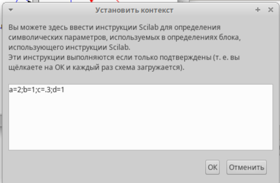
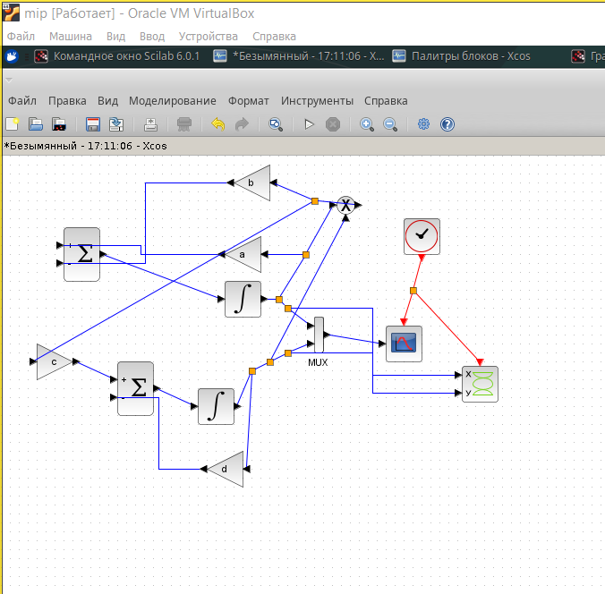
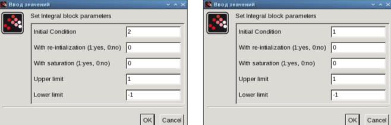
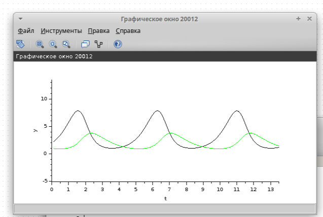
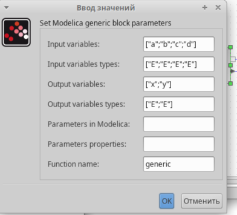
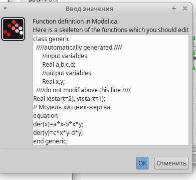
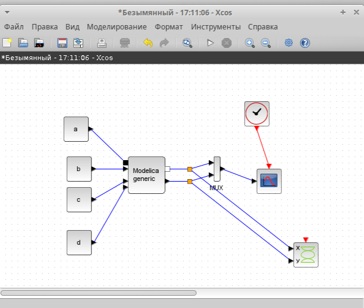
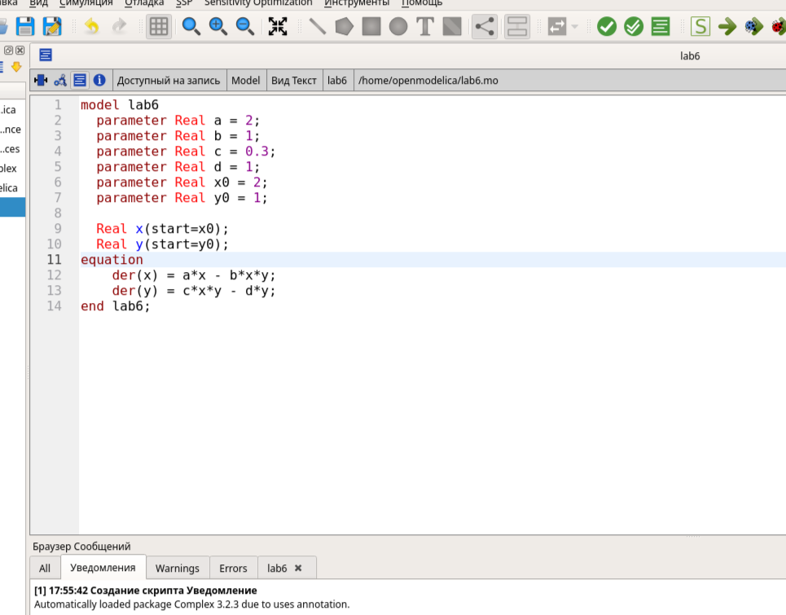
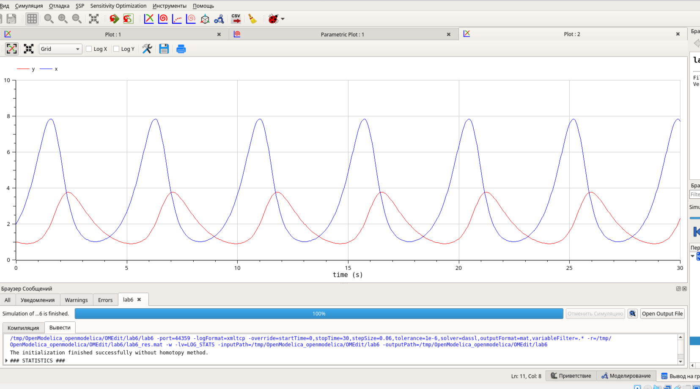
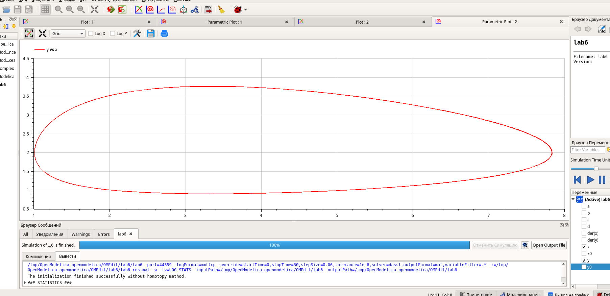

---
## Front matter
title: "Отчёт по лабораторной работе №6"
subtitle: " Модель «хищник–жертва»"
author: "Ощепков Дмитрий Владимирович НФИбд-01-22"

## Generic otions
lang: ru-RU
toc-title: "Содержание"

## Bibliography
bibliography: bib/cite.bib
csl: pandoc/csl/gost-r-7-0-5-2008-numeric.csl

## Pdf output format
toc: true # Table of contents
toc-depth: 2
lof: true # List of figures
lot: true # List of tables
fontsize: 12pt
linestretch: 1.5
papersize: a4
documentclass: scrreprt
## I18n polyglossia
polyglossia-lang:
  name: russian
polyglossia-otherlangs:
  name: english
## I18n babel
babel-lang: russian
babel-otherlangs: english
## Fonts
mainfont: Arial
romanfont: Arial
sansfont: Arial
monofont: Arial
mainfontoptions: Ligatures=TeX
romanfontoptions: Ligatures=TeX
sansfontoptions: Ligatures=TeX,Scale=MatchLowercase
monofontoptions: Scale=MatchLowercase,Scale=0.9
## Biblatex
biblatex: true
biblio-style: "gost-numeric"
biblatexoptions:
  - parentracker=true
  - backend=biber
  - hyperref=auto
  - language=auto
  - autolang=other*
  - citestyle=gost-numeric
## Pandoc-crossref LaTeX customization
figureTitle: "Рис."
tableTitle: "Таблица"
listingTitle: "Листинг"
lofTitle: "Список иллюстраций"
lotTitle: "Список таблиц"
lolTitle: "Листинги"
## Misc options
indent: true
header-includes:
  - \usepackage{indentfirst}
  - \usepackage{float} # keep figures where there are in the text
  - \floatplacement{figure}{H} # keep figures where there are in the text
---

# Цель работы

Реализовать модель "хищник-жертва" в xcos.

# Задание

Реализовать модель "хищник-жертва" в xcos;
Реализовать модель "хищник-жертва" с помощью блока Modelica в xcos;
Реализовать модель "хищник-жертва" в OpenModelica

# Выполнение лабораторной работы

Открыл Scilab, там открыл xcos

Зафиксируем начальные данные: a = 2, b = 1, c = 0, 3, d = 1, x(0) = 2, y(0) = 1.
В меню Моделирование, Задать переменные окружения зададим значения коэффициентов a, b, c, d (рис. 6.1).

{ #fig:001 width=70% }

Собрал схему

{ #fig:002 width=70% }

Настраиваю блоки (рис. [-@fig:003])

{ #fig:003 width=70% }

{ #fig:004 width=70% }

 # Реализация модели с помощью блока Modelica в xcos

{ #fig:005 width=70% }

{ #fig:006 width=70% }

{ #fig:007 width=70% }

{ #fig:008 width=70% }

Упражнение. Реализуйте модель «хищник – жертва» в OpenModelica. Постройте
графики изменения численности популяций и фазовый портрет.

{ #fig:09 width=70% }

{ #fig:010 width=70% }

{ #fig:011 width=70% }

# Выводы

В процессе выполнения данной лабораторной реализована модель "хищник-жертва" в xcos.