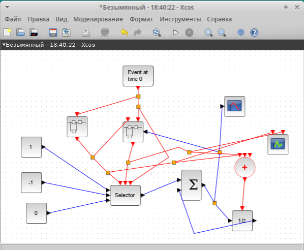
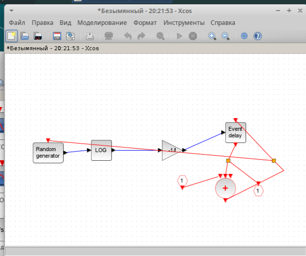
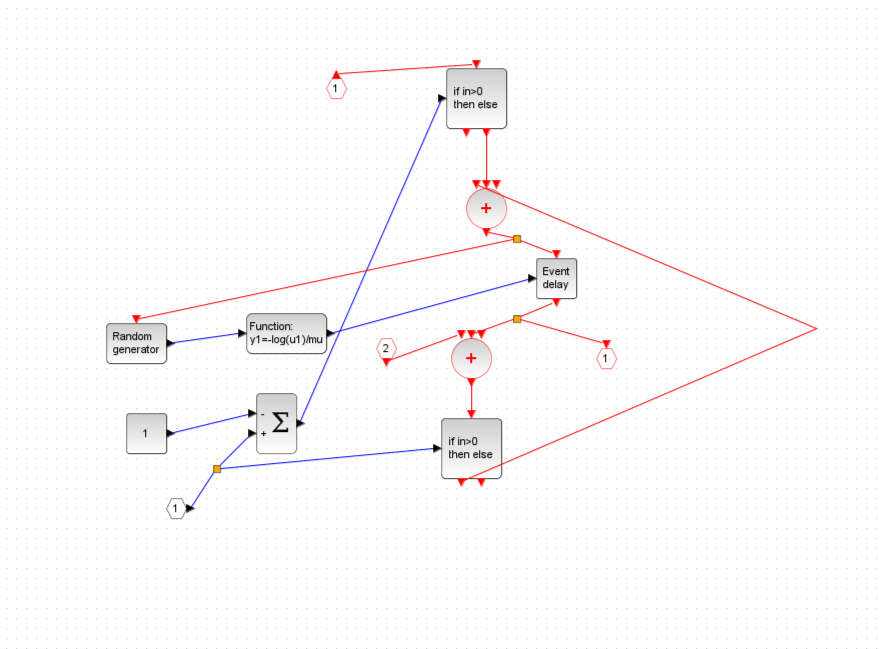
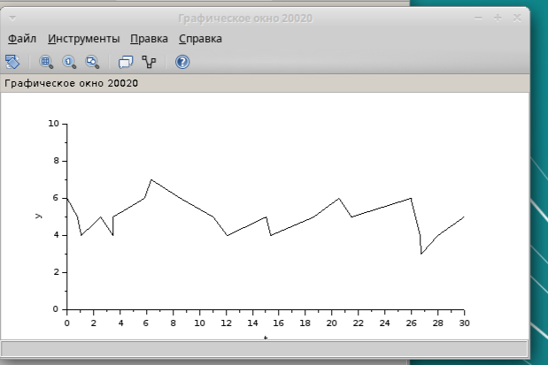
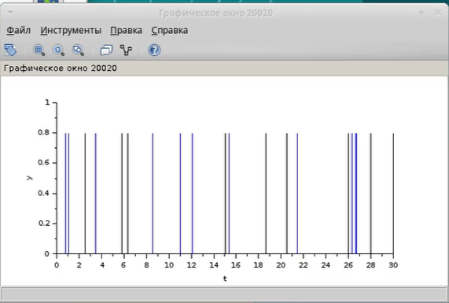

---
## Front matter
lang: ru-RU
title: Лабораторная Работа №7
subtitle: "Лабораторная работа 7. Модель M|M|1|∞"
author:
  - Ощепков Дмитрий Владимирович
institute:
  - Российский университет дружбы народов им. Патриса Лумумбы, Москва, Россия

## i18n babel
babel-lang: russian
babel-otherlangs: english

## Formatting pdf
toc: false
toc-title: Содержание
slide_level: 2
aspectratio: 169
section-titles: true
theme: metropolis
header-includes:
 - \metroset{progressbar=frametitle,sectionpage=progressbar,numbering=fraction}
 - '\makeatletter'
 - '\makeatother'

## Fonts
mainfont: Arial
romanfont: Arial
sansfont: Arial
monofont: Arial
---

## Докладчик

  * Ощепков Дмитрий Владимирович 
  * НФИбд-01-22
  * Российский университет дружбы народов
  * [1132226442@pfur.ru]
  
## Цель работы

Реализовать модель Модель M|M|1|∞

## Задание

Реализовать модель Модель M|M|1|∞ в xcos

## Выполнение лабораторной работы

Рассмотрим пример моделирования в xcos системы массового обслуживания типа
M|M|1|∞.
Зафиксируем начальные данные: λ = 0, 3, µ = 0, 35, z0 = 6.

## Модель M|M|1|∞ в xcos
{ #fig:001 width=70% }

## Суперблок, моделирующий поступление заявок

{ #fig:002 width=70% }

## Суперблок, моделирующий обработку заявок

{ #fig:003 width=70% }

## Динамика размера очереди

{ #fig:004 width=70% }

## Поступление ( — ) и обработка (– · · – ) заявок

{ #fig:005 width=70% }

# Выводы

В процессе выполнения данной лабораторной реализована модель Модель M|M|1|∞