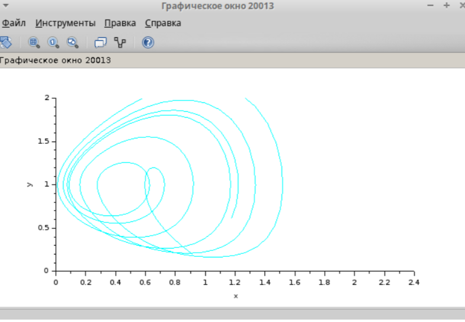

---
## Front matter
lang: ru-RU
title: Лабораторная Работа №8
subtitle: "Модель TCP/AQM"
author:
  - Ощепков Дмитрий Владимирович
institute:
  - Российский университет дружбы народов им. Патриса Лумумбы, Москва, Россия

## i18n babel
babel-lang: russian
babel-otherlangs: english

## Formatting pdf
toc: false
toc-title: Содержание
slide_level: 2
aspectratio: 169
section-titles: true
theme: metropolis
header-includes:
 - \metroset{progressbar=frametitle,sectionpage=progressbar,numbering=fraction}
 - '\makeatletter'
 - '\makeatother'

## Fonts
mainfont: Arial
romanfont: Arial
sansfont: Arial
monofont: Arial
---

## Докладчик

  * Ощепков Дмитрий Владимирович 
  * НФИбд-01-22
  * Российский университет дружбы народов
  * [1132226442@pfur.ru]
  
## Цель работы

Реализовать  Модель TCP/AQM
## Задание

Реализовать Модель TCP/AQM

## Выполнение лабораторной работы

Зададим контекст в xcos
N = 1, R = 1, K = 5, 3, C = 1, W(0) = 0, 1, Q(0) = 1

{ #fig:001 width=70% }

## Модель TCP/AQM 
{ #fig:002 width=70% }

## Вывод
{ #fig:003 width=70% }

## Фазовый портрет 
{ #fig:004 width=70% }

## Решим задачу в OpenModelica
Пограмма на OpenModelica

{ #fig:005 width=70% }

## Вывод
{ #fig:006 width=70% }

## Фазовый портрет 
{ #fig:007 width=70% }

## Выводы

В процессе выполнения данной лабораторной реализована модель TCP/AQM