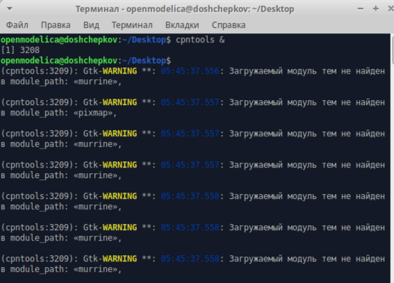
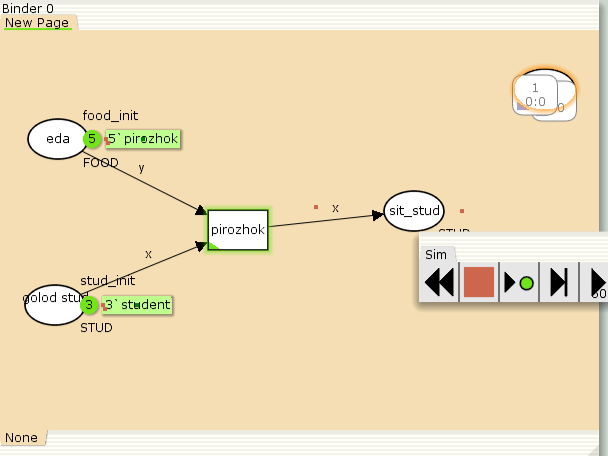
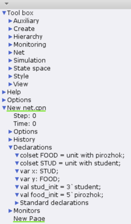

---
## Front matter
lang: ru-RU
title: Лабораторная Работа №9
subtitle: "Модель накорми студентов"
author:
  - Ощепков Дмитрий Владимирович
institute:
  - Российский университет дружбы народов им. Патриса Лумумбы, Москва, Россия

## i18n babel
babel-lang: russian
babel-otherlangs: english

## Formatting pdf
toc: false
toc-title: Содержание
slide_level: 2
aspectratio: 169
section-titles: true
theme: metropolis
header-includes:
 - \metroset{progressbar=frametitle,sectionpage=progressbar,numbering=fraction}
 - '\makeatletter'
 - '\makeatother'

## Fonts
mainfont: Arial
romanfont: Arial
sansfont: Arial
monofont: Arial
---

## Докладчик

  * Ощепков Дмитрий Владимирович 
  * НФИбд-01-22
  * Российский университет дружбы народов
  * [1132226442@pfur.ru]
  
## Цель работы

Реализовать  Модель накорми студентов в CPNtools

## Задание

Реализовать  Модель накорми студентов 

## Выполнение лабораторной работы

Модель «Накорми студентов»

{ #fig:001 width=70% }

## Модель «Накорми студентов»

{ #fig:002 width=70% }

В меню задаём новые декларации модели: типы фишек, начальные значения
позиций, выражения для дуг. Для этого наведя мышку на меню Standart declarations,
правой кнопкой вызываем контекстное меню и выбираем New Decl (рис. 9.2).
После этого задаем тип s фишкам, относящимся к студентам, тип p — фишкам,
относящимся к пирогам, задаём значения переменных x и y для дуг и начальные
значения мультимножеств init_stud и init_food

## Настройки

{ #fig:003 width=70% }

# Выводы

Реализовал Модель накорми студентов 