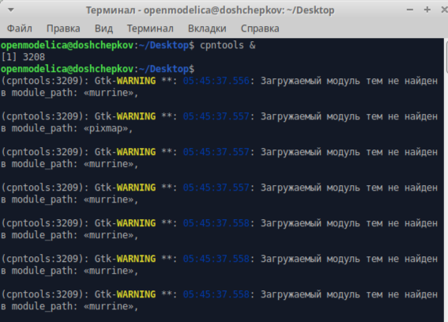
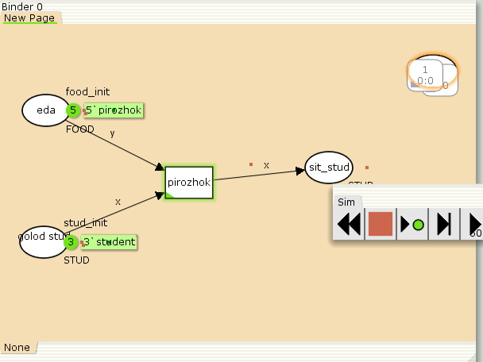

---
## Front matter
title: "Отчёт по лабораторной работе №9"
subtitle: "Модель накорми студентов"
author: "Ощепков Дмитрий Владимирович НФИбд-01-22"

## Generic otions
lang: ru-RU
toc-title: "Содержание"

## Bibliography
bibliography: bib/cite.bib
csl: pandoc/csl/gost-r-7-0-5-2008-numeric.csl

## Pdf output format
toc: true # Table of contents
toc-depth: 2
lof: true # List of figures
lot: true # List of tables
fontsize: 12pt
linestretch: 1.5
papersize: a4
documentclass: scrreprt
## I18n polyglossia
polyglossia-lang:
  name: russian
polyglossia-otherlangs:
  name: english
## I18n babel
babel-lang: russian
babel-otherlangs: english
## Fonts
mainfont: Arial
romanfont: Arial
sansfont: Arial
monofont: Arial
mainfontoptions: Ligatures=TeX
romanfontoptions: Ligatures=TeX
sansfontoptions: Ligatures=TeX,Scale=MatchLowercase
monofontoptions: Scale=MatchLowercase,Scale=0.9
## Biblatex
biblatex: true
biblio-style: "gost-numeric"
biblatexoptions:
  - parentracker=true
  - backend=biber
  - hyperref=auto
  - language=auto
  - autolang=other*
  - citestyle=gost-numeric
## Pandoc-crossref LaTeX customization
figureTitle: "Рис."
tableTitle: "Таблица"
listingTitle: "Листинг"
lofTitle: "Список иллюстраций"
lotTitle: "Список таблиц"
lolTitle: "Листинги"
## Misc options
indent: true
header-includes:
  - \usepackage{indentfirst}
  - \usepackage{float} # keep figures where there are in the text
  - \floatplacement{figure}{H} # keep figures where there are in the text
---

# Цель работы

Реализовать  Модель накорми студентов в CPNtools

# Задание

Реализовать  Модель накорми студентов 

# Выполнение лабораторной работы

Модель «Накорми студентов»

{ #fig:001 width=70% }

{ #fig:002 width=70% }

В меню задаём новые декларации модели: типы фишек, начальные значения
позиций, выражения для дуг. Для этого наведя мышку на меню Standart declarations,
правой кнопкой вызываем контекстное меню и выбираем New Decl (рис. 9.2).
После этого задаем тип s фишкам, относящимся к студентам, тип p — фишкам,
относящимся к пирогам, задаём значения переменных x и y для дуг и начальные
значения мультимножеств init_stud и init_food

{ #fig:003 width=70% }

# Выводы

Реализовал Модель накорми студентов 